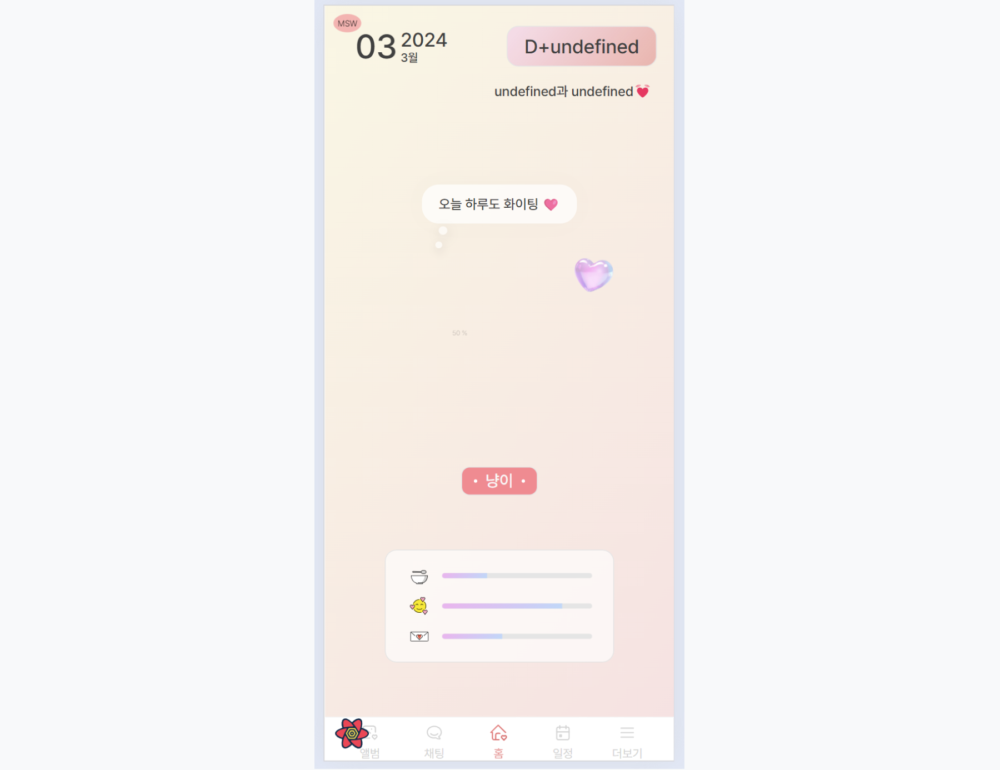
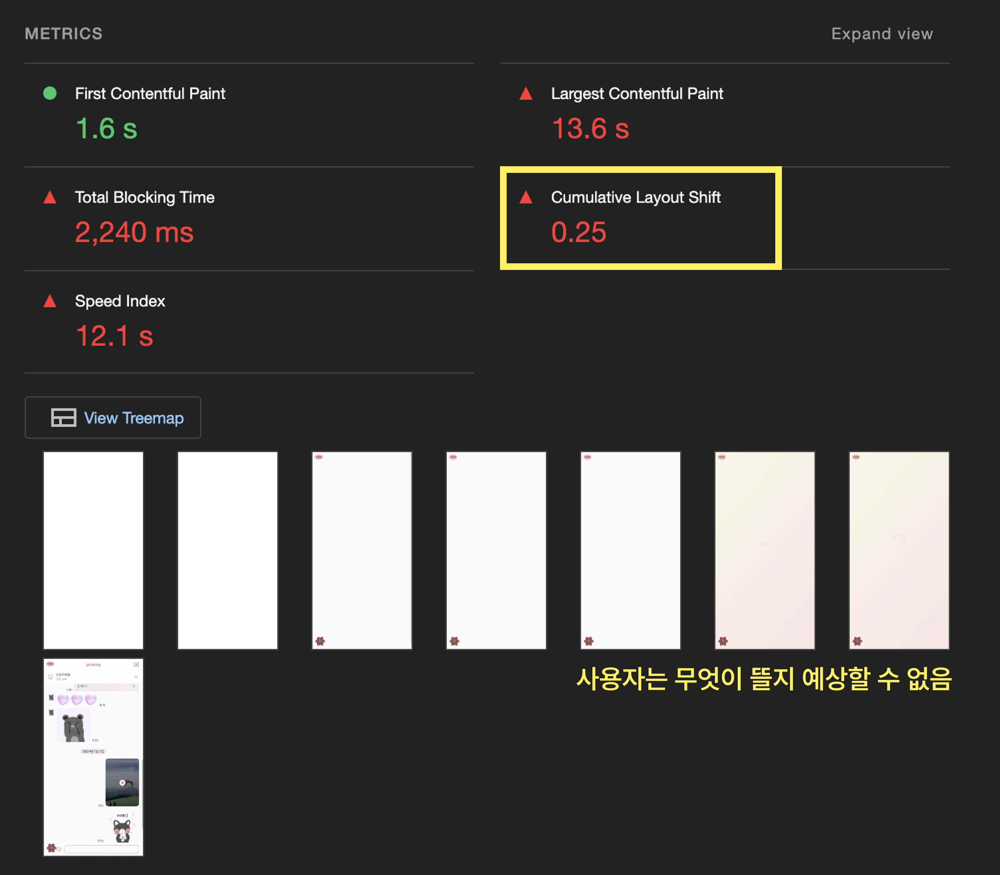
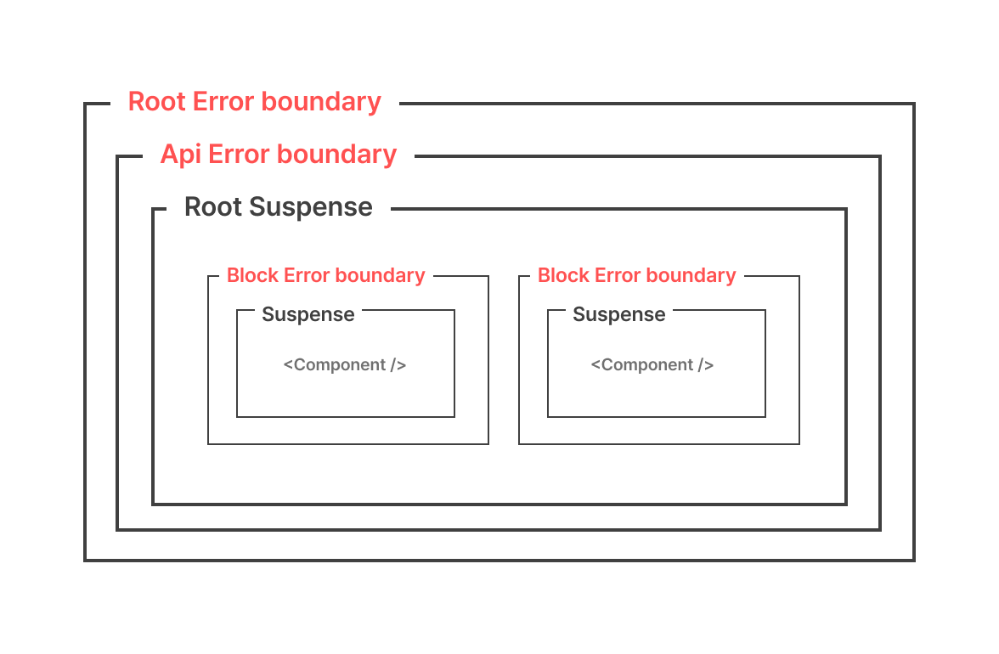
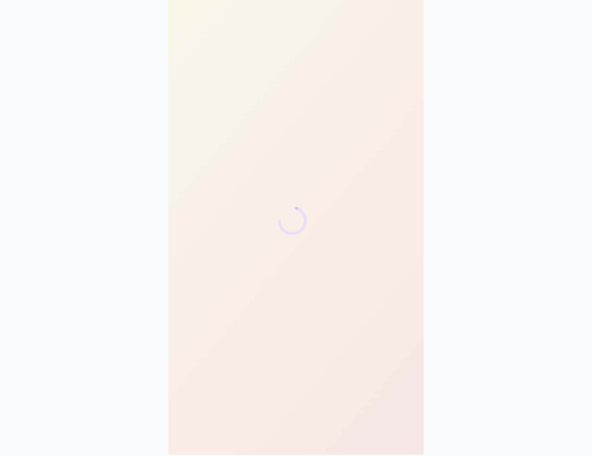
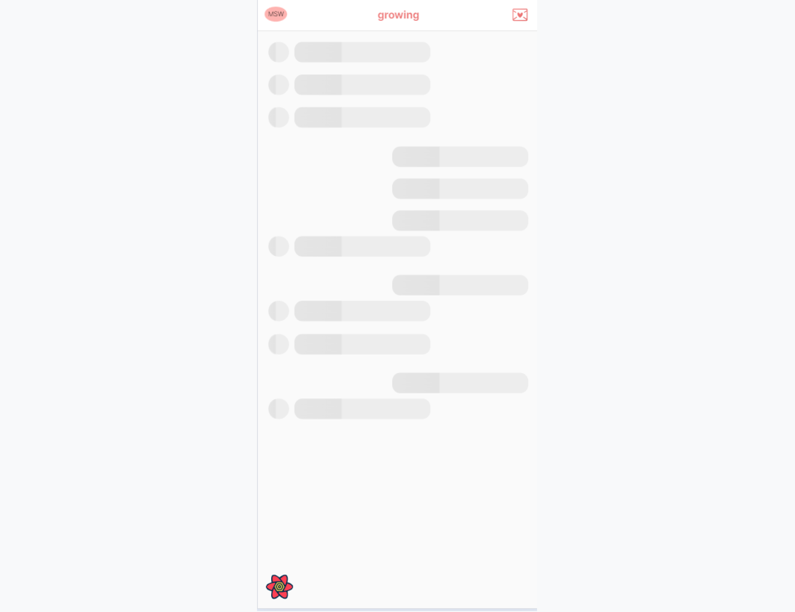
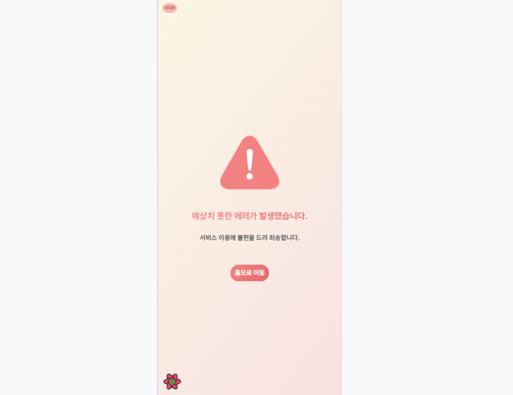
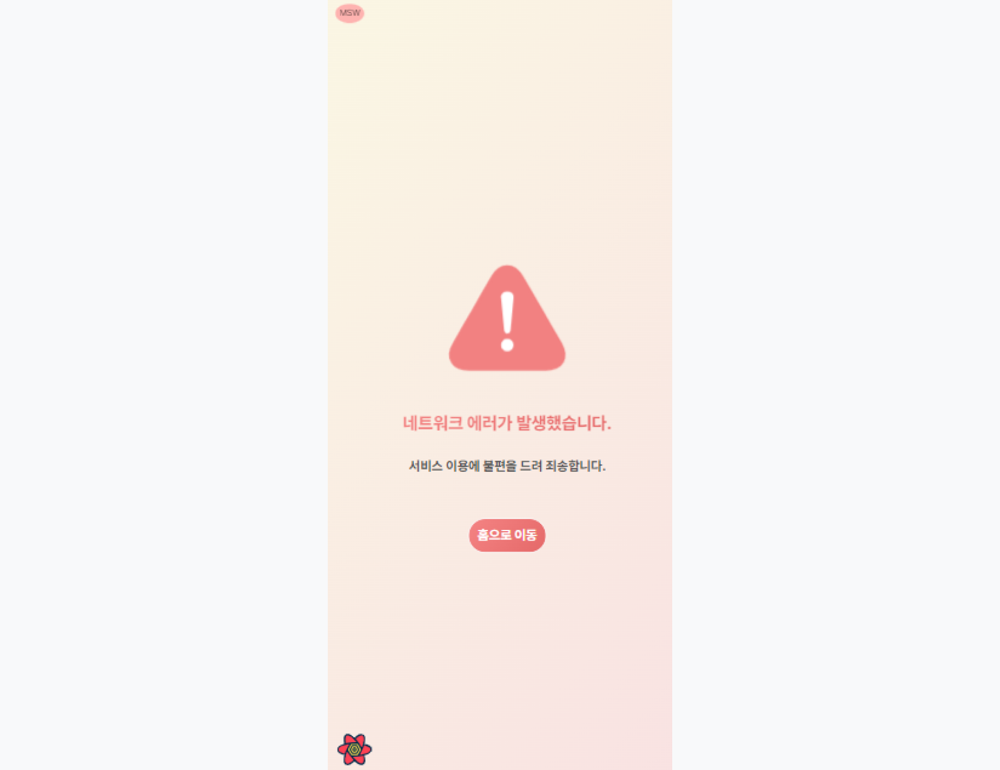
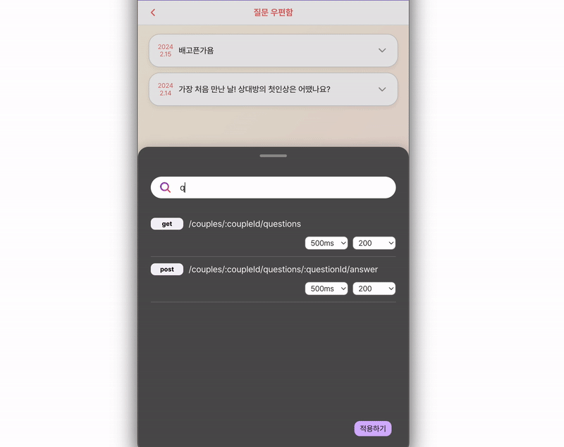
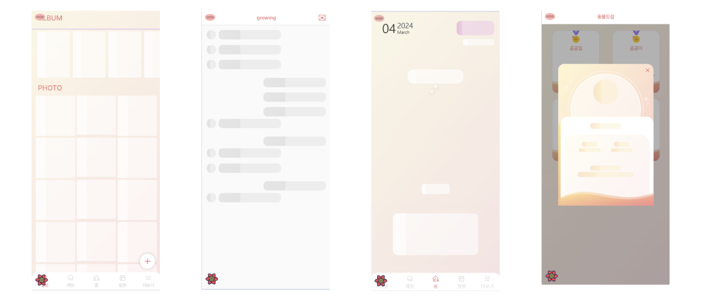
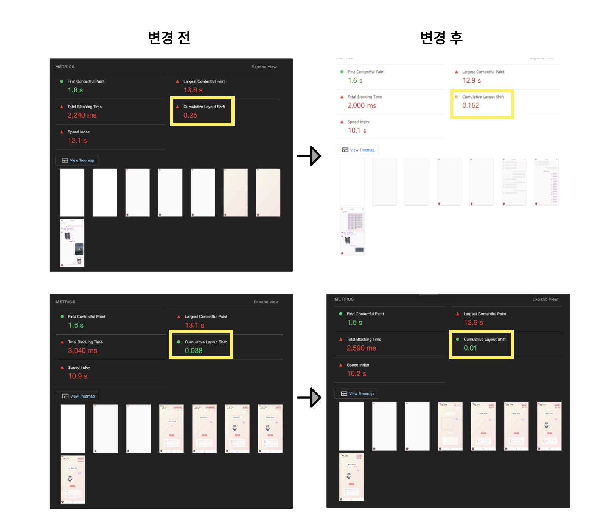

## 비동기 처리를 ‘잘’ 해보자.

비동기 처리는 프론트엔드 개발에서 피할 수 없는 중요한 부분이에요.

특히 사용자 경험(UX)에 큰 영향을 미치는데요, 사용자에게 끊김 없는 경험을 제공하기 위해서는 로딩, 성공, 상태 등 비동기 작업의 상태를 적절하게 관리하고 표현하는 것이 필수적이죠.

이번 글에서는 그로잉 팀의 비동기 처리와 사용자 경험(UX) 향상 전략에 대해 소개할게요.

## 문제점1: 프론트엔드에서 비동기 처리 로직을 깔끔히 처리하긴 쉽지 않다.

프론트엔드에서 비동기 처리 로직을 깔끔하게 처리하는 건 생각보다 쉽지 않아요. 다양한 상황을 고려해야 하기 때문이죠.

데이터를 불러오는 동안 사용자에게 로딩 상태를 표시해줘야 하고, 요청이 실패하거나 네트워크 문제가 발생했을 때는 이를 알려줘야 합니다. 또한, 요청이 성공적으로 완료되었을 때에는 받아온 데이터를 UI에 적절하게 표시해줘야 해요.

이러한 모든 상황을 각각의 컴포넌트 내에서 처리하려고 하면, 코드가 금방 복잡해지고 관리하기 어려워지곤 해요. 특히, 여러 비동기 요청을 동시에 처리해야 하는 경우나, 상태에 따른 다양한 UI 변화를 관리해야 하는 경우에는 더욱 그렇죠.

보통 아래와 같이 한 컴포넌트 내에서 로딩과 에러 처리를 동시에 수행하는 경우를 많이 봤을 거에요.

```jsx
const Profile = () => {
  const { data: profile, isError, isLoading } = useQuery(["profile"], fetchFoo)

  if (isError) return <div>로딩에 실패했습니다.</div>
  if (!isLoading) return <div>로딩 중입니다...</div>
  return <div>{profile?.name}님 안녕하세요!</div>
}
```

그러나 이는 관리해야할 로딩, 에러 상태가 많아질수록 코드의 가독성을 저하시킬 수 있으며 복잡한 컴포넌트가 될 가능성이 커지는 구조입니다.

## 문제점2: 적절하지 못한 비동기 처리는 성능 저하를 불러일으킨다.

또한 비동기 상태를 적절히 처리하지 않으면, 다른 개발자 뿐만 아니라 사용자에게 좋지 않은 경험을 줄 수 있어요.

그로잉 프로젝트에서는 이러한 로딩, 에러가 적절하게 처리되지 않고 있었는데요, 기존의 그로잉 프로젝트의 상황을 알아볼게요.

### 1. 부정적인 사용자 경험



기존에 그로잉 프로젝트에서는 데이터를 불러오기 전까지 별다른 처리를 하지 않았어요. 그래서 이 데이터가 필요한 곳은 데이터를 다 받아올 때까지 비어있어야 했습니다. 그래서 위 사진처럼 `undefined` 키워드가 잠시 노출되다가 불러온 데이터로 해당 부분이 채워졌어요.

이는 사용자 입장에서 매우 혼란스러울 수 있어요. 사용자들은 이해하기 쉬운 정보를 기대하는데 `undefined`와 같은 용어가 그대로 보여진다면 사용자 경험(UX)에 부정적인 영향을 미칠 수 있습니다.

### 2. CLS에 악영향



또한 콘텐츠가 로딩되는 동안 예기치 못한 레이아웃 이동이 일어날 수 있어요. 이를 수치화한 것을 `CLS(Cumulative Layout Shift)`라고 합니다.

위 사진은 그로잉 프로젝트에서 크롬 개발자도구의 Lighthouse를 사용해 성능을 측정한 사진이에요. 개선해야 할 다른 부분들도 많지만, `CLS(Cumulative Layout Shift)` 항목에서도 좋은 점수를 받지 못하고 있다는 것을 알 수 있었어요.

## 이를 Suspense와 Error Boundary를 이용하여 해결해보자!

React는 컴포넌트의 로딩 상태와 에러 처리를 선언적으로 관리할 수 있도록 [Suspense](https://react.dev/reference/react/Suspense)와 [Error Boundary](https://react.dev/reference/react/Component#catching-rendering-errors-with-an-error-boundary)를 제공하고 있는데요, 저희 그로잉 팀은 앞선 문제들을 해결하고자 이를 활용하기로 했어요.

두 개념에 대해 더 자세히 알아볼게요.

### Suspense

`Suspense`는 React가 비동기 작업(예: 데이터 가져오기)이 끝날 때까지 기다리고, 그 사이에 다른 컴포넌트(예: 로딩 화면)를 보여주게 해주는 도구에요.

`Suspense`를 사용하면, 데이터를 불러오는 동안 보여줄 로딩 화면을 쉽게 설정할 수 있어요.

간단한 예시를 통해 알아볼게요.

```tsx
<Suspense fallback={<LoadingSpinner />}>
  <Profile />
</Suspense>
```

`<Profile />` 은 실제로 렌더링하려고 하는 UI 부분이에요.

- 만약 이 부분이 렌더링하는 동안 지연(suspend)된다면, `<Suspense>` 경계는 `fallback`으로 전환하여 렌더링하게 됩니다.
- 이 때, `fallback`에 넣은 `<LoadingSpinner />` 컴포넌트가 잠깐 사용자에게 보여지게 돼요.

<br />

만약 여러 `Suspense` 컴포넌트를 겹쳐 사용한다면, 각기 다른 비동기 작업마다 다른 로딩 화면을 설정할 수도 있어요.

```tsx
<Suspense fallback={<div>Loading Photo...</div>}>
  <ProfilePhoto />
</Suspense>
<Suspense fallback={<div>Loading Details...</div>}>
  <ProfileDetails />
</Suspense>
```

<br />

또한 여러 개의 자식 요소가 겹쳐 있을 때 발생하는 `Waterfall` 현상을 해결할 수 있어요.

```tsx
import React, { Suspense } from "react"

const ProfilePhoto = React.lazy(() => import("./ProfilePhoto"))
const ProfileDetails = React.lazy(() => import("./ProfileDetails"))
const ProfileTimeline = React.lazy(() => import("./ProfileTimeline"))

function Profile() {
  return (
    <Suspense fallback={<div>Loading Profile...</div>}>
      <div>
        <ProfilePhoto />
        <ProfileDetails />
        <ProfileTimeline />
      </div>
    </Suspense>
  )
}
```

`Waterfall` 현상은 한 요소가 로드된 후에 다음 요소의 로딩이 시작되는 현상을 말해요. `Suspense`를 사용하면 여러 비동기 요소를 병렬로 로드하여 이 현상을 줄일 수 있습니다.

### Error boundary

`Error boundary`는 자식 컴포넌트 트리에서 발생한 JavaScript 에러를 잡아내고, 이를 로깅하거나 대체 UI를 렌더링하여 애플리케이션이 갑작스럽게 중단되는 것을 방지해주는 도구에요.

즉, 우리가 만든 웹 페이지에서 문제가 생겼을 때 그 문제를 잡아서 애플리케이션이 완전히 멈추지 않게 도와줘요, 이를 이용해 사용자에게 "문제가 발생했다"는 메시지를 보여주거나, 다른 화면을 보여줄 수 있어요.

아래는 `Error boundary`를 구현한 코드에요.

```tsx
class ErrorBoundary extends React.Component {
  constructor(props) {
    super(props)
    this.state = { hasError: false }
  }

  static getDerivedStateFromError(error) {
    // 다음 렌더링에서 fallback UI를 보여주기 위한 상태 업데이트
    return { hasError: true }
  }

  componentDidCatch(error, errorInfo) {
    // 에러 로깅 서비스에 에러 정보를 기록할 수 있습니다.
    logErrorToMyService(error, errorInfo)
  }

  render() {
    if (this.state.hasError) {
      // 에러가 발생했을 때 렌더링할 UI
      return <h1>오류가 발생했어요.</h1>
    }

    return this.props.children
  }
}
```

`Error boundary`를 사용하면 컴포넌트 트리의 어느 부분에서든 에러를 처리할 수 있어요. 주로 네트워크 에러, 데이터 처리 에러 등 런타임에 발생할 수 있는 예외를 처리하는 데 사용됩니다.

#### react-error-boundary 사용하기

React에서 에러 경계를 직접 구현하려면 클래스 컴포넌트를 사용해야 하며 `getDerivedStateFromError`와 `componentDidCatch` 라이프사이클 메서드를 모두 구현해야 해요.

하지만, 함수형 컴포넌트에서는 `Error boundary`를 직접 만들기 어려워요. 그래서 `react-error-boundary`라는 도구를 사용하면 좋은데요, 이 도구를 쓰면 복잡한 클래스 컴포넌트를 직접 만들지 않아도 간단한 컴포넌트와 훅을 통해 `Error boundary`를 사용할 수 있어요.

따라서 그로잉 프로젝트에서는 `react-error-boundary` 라이브러리를 사용하기로 결정했습니다.

### Suspense와 Error boundary를 함께 사용한다면?

`Suspense`와 `Error boundary`를 적용하기 전과 후의 코드를 비교해볼게요.

#### 적용 전

```tsx
const Profile = () => {
  const { data: profile, isError, isLoading } = useQuery(["profile"], fetchFoo)

  if (isError) return <div>로딩에 실패했습니다.</div>
  if (!isLoading) return <div>로딩 중입니다...</div>
  return <div>{profile?.name}님 안녕하세요!</div>
}
```

#### 적용 후

```tsx
function Profile() {
  const { data: profile } = useQuery(["profile"], fetchFoo)

  return <div>{profile?.name}님 안녕하세요!</div>
}
```

```jsx
<ErrorBoundary fallback={<ErrorFallback />}>
  <Suspense fallback={<LoadingSpinner />}>
    <Profile />
  </Suspense>
</ErrorBoundary>
```

`Suspense`와 `Error boundary`를 적용한 후, 더이상 `Profile` 컴포넌트는 비동기 데이터 로딩이나 에러 처리를 직접 관리하지 않아도 돼요. 이 두 가지 상황은 각각 `Suspense`와 `Error boundary`에 처리를 위임했어요.

#### 이점은 다음과 같아요.

1. **선언적인 코드**

   `Suspense`와 `Error boundary`를 사용하면, 비동기 로직과 에러 처리 로직을 컴포넌트 외부로 분리할 수 있습니다. 이로 인해 컴포넌트 코드가 더 선언적이고, 읽기 쉬워져요.

1. **향상된 사용자 경험(UX)**

   `Suspense`를 사용하면 비동기 작업이 진행되는 동안 사용자에게 로딩 스피너나 스켈레톤 UI를 손쉽게 보여줄 수 있어요. 또한, `Error boundary`를 통해 예외 상황이 발생했을 때 사용자에게 친절한 에러 메시지를 표시할 수도 있습니다.

<br />

따라서 그로잉 프로젝트에 `Suspense`와 `Error boundary`를 도입하는 리팩토링 전략을 세워보기로 했어요.

## 그로잉 프로젝트의 Suspense, Error boundary 전략

### React query + Suspense + Error boundary 같이 사용하기

그로잉 프로젝트에서는 api 호출 작업을 `react-query`로 하고 있는데요, `react-query`에서는 `Suspense`나 `Error boundary`와 통합할 수 있는 기능을 제공해주고 있어요.

따라서 그로잉에서는 `react-query`와 `Suspense`, `Error boundary`를 함께 사용했습니다.

```tsx
const queryClient = new QueryClient({
  defaultOptions: {
    queries: {
      //... other options
      suspense: true,
      useErrorBoundary: true,
    },
    mutations: {
      //... other options
      useErrorBoundary: true,
    },
  },
})
```

먼저, `suspense: true` 와`useErrorBoundary:true` 옵션을 통해 기본적으로 `Suspense`와 `Error boundary`를 사용하도록 했어요.

- `suspense: true`
  - `react-query`가 데이터를 가져오는 동안 `Suspense`를 통해 컴포넌트를 중단시키고, 데이터가 준비되면 자동으로 컴포넌트를 다시 렌더링해줍니다.
- `useErrorBoundary:true`
  - React의 `Error boundary`는 본래 이벤트 핸들러의 에러를 포착하지 않아요.
    그러나 `react-query`의 `useErrorBoundary` 옵션을 사용하면, API에서 발생한 에러를 `Error boundar`가 캐치할 수 있습니다. 따라서 해당 옵션을 true로 설정했어요.

> 그로잉에 프로젝트에서는 현재 `react-query` v4를 사용하고 있습니다.

### **컴포넌트 계층화**

그로잉에서는 이를 컴포넌트 계층별로 설계했어요.


`Suspense`와 `Error Boundary`를 사용할 영역을 세분화하여 각 컴포넌트의 로딩 및 에러 상태를 적절히 처리하고, 각 에러의 영향 범위를 최소화하고자 했습니다.

### 그로잉의 Suspense 전략

1. **Root Suspense**

   ```tsx
   // RootSuspense.tsx

   const RootSuspense = ({ children }: PropsWithChildren) => {
     return <Suspense fallback={<Fallback />}>{children}</Suspense>
   }
   ```

   애플리케이션 최상위에서 로딩상태를 처리해 줄 컴포넌트에요. 로딩 상태일 때 `Lottie`로 제작한 `Fallback` 컴포넌트를 보여줍니다.

   

2. **Suspense**

   최상위 RootSuspense와 별도로 필요한 곳에서는 `Suspense`를 사용해 로딩 상태를 따로 처리해주었어요. 이때의 fallback은 `react-loading-skeleton` 라이브러리를 사용해 제작한 스켈레톤 ui를 보여줍니다.

   

### 그로잉의 ErrorBoundary 전략

1. **Root ErrorBoundary**

   컴포넌트의 최상위에서 하위 `Error boundary`에서 처리하지 못한 에러들을 처리해 주는 `Root Error boundary`에요.

   ```tsx
   // RootErrorBoundary.tsx

   const RootErrorBoundary = ({ children }: PropsWithChildren) => {
     const { key } = useLocation()

     return (
       <ErrorBoundary FallbackComponent={Fallback} resetKeys={[key]}>
         {children}
       </ErrorBoundary>
     )
   }
   ```

   

2. **ApiErrorBoundary**

   네트워크 에러로 인해 api 호출을 성공하지 못한 경우를 처리해 줄 `API ErrorBoundary`에요.

   ```tsx
   // ApiErrorBoundary.tsx

   const ApiErrorBoundary = ({ children }: PropsWithChildren) => {
     const { reset } = useQueryErrorResetBoundary()
     const { key } = useLocation()

     return (
       <ErrorBoundary
         FallbackComponent={Fallback}
         onReset={reset}
         resetKeys={[key]}
       >
         {children}
       </ErrorBoundary>
     )
   }
   ```

   

3. **Block ErrorBoundary**

   지역적으로 `Error boundary`가 필요할 때 사용할 `Block ErrorBoundary` 컴포넌트에요.
   <br />
   <br />
   컴포넌트마다 `Error Boundary`를 설정하면 프로젝트의 복잡성을 증가시키고, 유지 보수를 어렵게 만들 수도 있어요. 따라서, 에러 처리 방법을 표준화하여 코드의 가독성과 유지 보수성을 유지하기 위해 Block Error Boundary를 만들어 사용했어요.
   <br />
   <br />

   공통적으로 사용되는 `onReset` 콜백과 `resetKeys`를 이 컴포넌트 안에서 설정함으로써 코드의 중복도 줄일 수 있었어요.

   <br />

   ```tsx
   // pages/.../BlockErrorBoundary.ts

   import { PropsWithChildren } from "react"
   import { useQueryErrorResetBoundary } from "@tanstack/react-query"
   import { useLocation } from "react-router-dom"
   import { ErrorBoundary, FallbackProps } from "react-error-boundary"

   interface Props extends PropsWithChildren {
     fallbackComponent: React.ComponentType<FallbackProps>
   }

   const BlockErrorBoundary = ({ children, fallbackComponent }: Props) => {
     const { reset } = useQueryErrorResetBoundary()
     const { key } = useLocation()

     return (
       <ErrorBoundary
         FallbackComponent={fallbackComponent}
         onReset={reset}
         resetKeys={[key]}
       >
         {children}
       </ErrorBoundary>
     )
   }

   export default BlockErrorBoundary
   ```

#### Error boundary의 resetKeys 옵션

`Error boundary`의 `resetKeys` 옵션에 대해 알아볼게요.

한 번 에러가 발생하고 `Error boundary`에 의해 캐치되면, 해당 컴포넌트 트리는 기본적으로 그 상태에서 멈춰 있게 돼요.
<br />
즉, 같은 에러가 다시 발생해도 `Error boundary`가 다시 반응하지 않습니다.

<br />

`resetKeys` 옵션을 설정하면 배열 안에 담긴 값이 바뀔 때마다 ErrorBoundary로 잡힌 에러를 초기화해줘요.
<br />

`resetKeys`옵션에 배열 형태로 값을 지정하면, 이 배열 내의 값이 변경될 때마다 `Error boundary`가 내부 상태를 초기화하고, 자식 컴포넌트 트리를 다시 마운트합니다. 이를 통해 동일한 에러가 반복되어도 `Error boundary`가 다시 반응하게 만들고, 필요한 경우 새로운 에러 처리 또는 대체 UI를 제공할 수 있어요.

> 🤔 **resetKeys에 들어갈 값 선택하기: useLocation의 path vs key**
>
> - path를 사용하는 경우:
>   - 각 페이지(경로) 마다 독립적인 에러 처리가 필요할 때
> - key를 사용하는 경우:
>   - key는 라우트 세션의 고유 식별자로, 라우트가 변경될 때마다 새로운 값이 생성됨.
>   - 라우트가 변경될 때마다 `ErrorBoundary`를 리셋하고자 할 때 사용

그로잉에서는 여러 페이지에서 같은 query data를 사용하는 경우가 많이 있어요.
<br />
그래서 페이지를 이동할 때마다 에러를 리셋해 다음 페이지에 영향을 미치지 않게 하기 위해 `resetKeys` 속성에 `useLocation`에서 제공해주는 `key` 값을 사용했습니다.

### 사용 예시

1. 먼저 최상위에서 에러를 처리해줄 `RootErrorBoundary`, `ApiErrorBoundary`, `RootSuspense`로 App컴포넌트를 감싸줍니다.

   ```tsx
   <RootErrorBoundary>
     <ApiErrorBoundary>
       <RootSuspense>
         <App />
       </RootSuspense>
     </ApiErrorBoundary>
   </RootErrorBoundary>
   ```

2. 그리고 지역적으로 에러와 로딩 처리가 필요한 곳에서 `Suspense`와 `BlockErrorBoundary`를 사용하면 돼요.

   ```tsx
   <BlockErrorBoundary fallbackComponent={NoticeList.Error}>
     <Suspense fallback={<NoticeList.Loading />}>
       <NoticeList />
     </Suspense>
   </BlockErrorBoundary>
   ```

   ```tsx
   const NoticeList = () => {
       ...
   };

   NoticeList.Loading = () => {
        return (
            <S.LoadingContainer>
            {new Array(20).fill(null).map((_, i) => (
                <Skeleton height={62} borderRadius={10} key={i} />
            ))}
            </S.LoadingContainer>
        );
   };

   NoticeList.Error = ({ error, resetErrorBoundary }: FallbackProps) => {
        return (
            <BlockErrorFallback.Common
            error={error}
            resetErrorBoundary={resetErrorBoundary}
            />
        );
   };

   export default NoticeList;
   ```

필요한 컴포넌트에 에러 상태와 로딩 상태에 표시할 컴포넌트를 서브 컴포넌트로 (`NoticeList.Loading` `NoticeList.Error`) 등록해 사용했어요.

서브 컴포넌트를 사용하는 방법은 어떤 컴포넌트를 위한 것인지 알기 쉽고, 관련 기능이나 스타일을 찾기 쉽다는 장점이 있는 방식이에요.

## Suspense와 ErrorBoundary를 모든 상황에 쓰는 게 좋을까요?

그렇다면 이 `Suspense`와 `Error boundary`를 비동기 호출이 발생하는 모든 컴포넌트에 적용해야 할까요?

저희는 그렇지 않다고 생각해요. 특정 상황에서는 `Suspense`나 `Error boundary`를 사용하지 않고 다른 방법을 사용하는 것이 더 적합할 수도 있어요.

### Suspense 사용을 피해야 하는 경우

예를 들면 사용자의 특정 액션(버튼 클릭 등)에 의해 트리거되는 로딩 작업의 경우, `Suspense`를 사용하기보다는 로컬 상태 관리를 통해 로딩 상태를 직접 제어하는 것이 더 직관적이에요.


### Error boundary가 캐치할 수 없는 에러를 처리해야 하는 경우

`Error boundary`는 React 애플리케이션에서 에러를 효과적으로 관리하는 중요한 도구지만, 모든 종류의 에러를 잡아내지는 못해요.

따라서 특정 상황에서는 `Error boundary`의 한계를 인지하고 다른 에러 처리 방법을 고려해야 할 수도 있어요.

### Error Boundary가 잡아내지 못하는 에러들은 다음과 같아요.

1. **비동기적 코드**
   - `setTimeout`, `requestAnimationFrame` 같은 비동기 콜백에서 발생한 에러는 `Error boundary`로 잡아낼 수 없어요. 이러한 경우, 콜백이 실행되는 시점에는 이미 컴포넌트의 렌더링 컨텍스트가 종료되었기 때문이죠.
2. **이벤트 핸들러**
   - React는 이벤트를 최상위 root element에서 처리하기 때문에, `Error boundary` 내부에서 발생한 이벤트 핸들러의 에러를 포착할 수 없어요. 이는 `Error boundary`의 범위가 이벤트 버블링의 root보다 아래에 위치하기 때문입니다.
3. **Error Boundary 자체의 에러**
   - `Error boundary` 컴포넌트 내부에서 발생한 에러는 그 자체로 잡아낼 수 없어요. 이러한 경우, 상위 또는 다른 `Error boundary`를 통해 에러를 관리해야 합니다.

### **Error Boundary의 한계 극복 방법**

1. **try…catch를 활용하기**
   - 비동기 작업을 `Promise`나 `async/await`과 함께 사용할 때는, 해당 작업의 에러 핸들링 로직을 직접 구현해야 합니다. 예를 들어, `.catch()` 메서드나 `try...catch` 블록을 사용할 수 있죠.
2. `react-query`**의** `useErrorBoundary`**옵션**
   - react-query의 useErrorBoundary옵션을 사용하면 비동기 작업에서 발생하는 에러를 캐치해 `Error Boundary`로 처리를 할 수 있어요.
3. **에러 상태를 전역 상태로 관리하기**
   - 에러 상황을 전역 상태로 관리하여 적절한 UI를 렌더링하는 방법도 고려할 수 있어요.
4. **컴포넌트 자체의 에러 처리**
   - 각 컴포넌트가 자신의 에러를 처리할 수 있도록 만들어, 에러 발생 시 대체 컴포넌트를 렌더링하는 등의 방법으로 문제를 해결할 수 있어요.

### 그로잉에서 사용한 방법

그로잉 프로젝트에서는 비동기 작업 시 발생하는 에러 등 Error boundary가 catch해주지 못하는 에러는 UI를 바꾸는 것보다 사용자에게 간단히 알려주는 게 더 적합한 경우가 많았어요.

따라서 이를 Error boundary가 아닌 toast message를 사용해 처리하도록 했습니다. 이를 통해 에러의 발생을 알리는 동시에 애플리케이션의 나머지 기능은 계속 사용할 수 있게 해주었어요.

```tsx
  const { mutateAsync: postAnswer } = useAnswerMutation({
		...
    options: {
     useErrorBoundary: false,
      onSuccess: () => {
        addToast('답변을 등록했어요.');
      },
      onError: () => {
        addToast('답변 등록에 실패했어요. 이용에 불편을 드려 죄송합니다.');
      },
    },
  });

```



## Suspense, Error boundary를 합쳐 사용해도 될까요?

```tsx
//AsyncBoundary.tsx
...

export default function AsyncBoundary({
  pendingFallback,
  rejectedFallback,
  children,
  ...errorBoundaryProps
}: Props) {
  return (
    <ErrorBoundary fallbackRender={rejectedFallback} {...errorBoundaryProps}>
      <Suspense fallback={pendingFallback}>{children}</Suspense>
    </ErrorBoundary>
  );
}

```

처음에는 `Suspense`와 `Error boundary`가 함께 사용되는 경우가 많아, 위 코드처럼 둘을 합친 `AsyncBoundary`를 만들어 사용하려 했어요. 하지만 막상 사용해보니 `Error boundary` 하나에 `Suspense`를 여러개를 사용하는 등 1:1로 사용하지 않는 경우들이 꽤 있었어요.

<br />

예를 들어 아래와 같이 로딩 상태는 여러 부분에서 따로 처리하고 싶지만, 에러는 한번에 모아서 처리하고 싶은 상황이 있을 수 있어요. 이런 경우에 모든 `Suspense`에 `Error boundary`가 함께 있는 것은 불필요하기 때문에 `Suspense`와 `Error boundary`를 결합하지 않기로 했어요.

```tsx
const Pet = () => {
  return (
    <S.Container>
      <ErrorBoundary FallbackComponent={Pet.Error}>
        <Suspense fallback={<Ballon.Loading />}>
          <Ballon />
        </Suspense>

        <RaisingPet />

        <Suspense fallback={<PetLabel.Loading />}>
          <PetLabel />
        </Suspense>

        <Suspense fallback={<PetGauge.Loading />}>
          <PetGauge />
        </Suspense>
      </ErrorBoundary>
    </S.Container>
  )
}
```

## 결과

### 1. 선언적인 코드 작성이 가능해졌어요.

- **적용 전:** 컴포넌트가 비동기 상태 처리때문에 복잡했어요.

  ```tsx
  const Emojis = () => {
    const {
      data: emojis,
      isLoading,
      isError,
    } = useEmojiDetailData({
      emojiId: id,
    })

    if (isLoading) {
      // 로딩 시
      return (
        <S.EmojiGrid>
          {skeletonArr.map((_, idx) => (
            <Skeleton key={idx} width={80} height={80} />
          ))}
        </S.EmojiGrid>
      )
    }

    if (isError) {
      // 에러 시
      return (
        <ErrorFallback>
          <p>에러가 발생했어요</p>
        </ErrorFallback>
      )
    }

    return (
      // 응답 성공 시
      <S.EmojiGrid>
        {emojis?.map(emoji => (
          <S.StyledImg
            key={emoji.id}
            src={emoji.imageUrl}
            onClick={() => handleClick(emoji.id)}
          />
        ))}
      </S.EmojiGrid>
    )
  }
  ```

- **적용 후:** 비동기 로직과 에러 처리 로직을 컴포넌트 외부로 분리할 수 있게 됨으로써, 코드가 더 선언적이고 읽기 쉬워졌어요.

  ```tsx
  <BlockErrorBoundary fallbackComponent={Emojis.Error}>
    <Suspense fallback={<Emojis.Loading />}>
      <Emojis />
    </Suspense>
  </BlockErrorBoundary>
  ```

  ```tsx
  const Emojis = () => {
    const {
      data: emojis,
      isLoading,
      isError,
    } = useEmojiDetailData({
      emojiId: id,
    })

    return (
      <S.EmojiGrid>
        {emojis?.map(emoji => (
          <S.StyledImg
            key={emoji.id}
            src={emoji.imageUrl}
            onClick={() => handleClick(emoji.id)}
          />
        ))}
      </S.EmojiGrid>
    )
  } // 간단해짐
  ```

### 2. 사용자 경험이 향상됐어요.

- 사용자는 데이터를 가져오는 동안 빈 화면을 보지 않게 되었어요.

  

- 그리고 데이터를 받아오는 중에 에러가 발생한 경우 버튼 등을 통해 다시 시도할 수 있고, 어떤 작업을 요청했을 때 에러가 발생하면 toast message를 작업 상황을 받아볼 수 있습니다.

  

### 3. CLS도 향상되었어요.

`CLS(Cumulative Layout Shift)`도 향상되었는지 확인해볼게요.

> - CLS 기준 점수
>   <br />- 0.1 이하인 경우 좋음
>   <br />- 0.25 이하인 경우 보통
>   <br />- 그 외에는 개선이 필요한 나쁜 점수

데이터가 들어갈 자리에 Skeleton이 미리 차지하도록 했기 때문에 `CLS` 지표가 개선된 것을 볼 수 있어요.



### 마치며

이를 통해 그로잉 프로젝트는 개발자 경험(DX)과 사용자 경험(UX) 모두 높일 수 있었어요.

<br />
특히 이전에 만들었던 MSW Toolbar를 활용하여 쉽게 테스트해가며 작업할 수 있었습니다.


> 🤔 그로잉 팀의 MSW Toolbar 제작기가 궁금하다면? ⇒ [그로잉 팀의 MSW Toolbar 제작기](https://teamgrowing.github.io/team-blog/msw-toolbar)

<br />

앞으로도 적절한 비동기 처리로 사용자에게 더 나은 서비스를 제공하는 그로잉 팀이 되어볼게요. 감사합니다 :)
