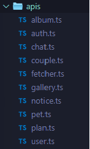
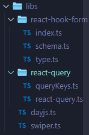
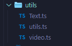
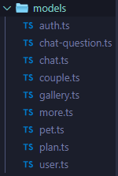
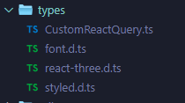
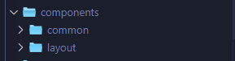
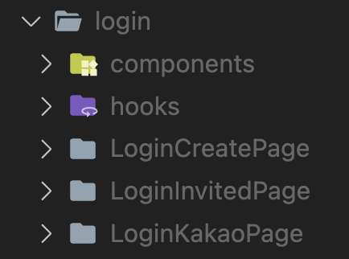

안녕하세요. 그로잉 FE팀입니다! 😀

현재, 저희는 그로잉 프로젝트 리팩토링을 앞두고 있어요.

작성한지 1-2년 된 코드였기에 본격적인 리팩토링을 시작하기 전, 사용하지 않는 파일들을 정리하고 폴더 구조를 다듬을 필요가 있었어요. 프로젝트의 폴더 구조를 잘 정의하는 것은 앞으로의 개발 효율성에 영향을 주는 중요한 요소이기도 하죠. 순간의 선택이 10년을 좌우한다는 말이 있듯, 앞으로의 리팩토링 효율성을 좌우할 폴더 구조를 어떻게 개편했을까요?

저희가 파악한 그로잉 프로젝트의 폴더 구조의 문제점은 총 4가지가 있었어요.

## 문제점 1: 폴더의 이름과 역할의 모호함

첫번째로 발견한 문제점은 폴더의 이름과 이에 따른 역할이 불분명하다는 것입니다. 폴더의 이름과 폴더 내부 파일의 역할이 잘 맞게 개선하기 위해 다음과 같이 폴더 구조를 변경했어요.

### 1. services, util → apis, libs, utils

저희가 기존에 정의했던 폴더 구조에는 services폴더가 있었어요. services에는 비즈니스 로직을 모아두기로 했는데, 비즈니스 로직의 범위가 애매해 api들을 정의해두는 곳으로 사용했어요. 그리고 라이브러리와 관련된 코드, 프로젝트의 여러 곳에서 재사용되는 간단한 함수 등은 util폴더에 넣었습니다.

**한 폴더에 여러 역할의 파일들이 들어가 있다는 문제**를 해결하기 위해 services와 utils폴더를 apis, libs, utils 총 3개의 폴더로 분리하기로 결정했어요.

- **apis**
  

  - 백엔드 서버에 요청을 보내기 위한 api를 저장하기 위한 폴더입니다.
  - 데이터와 관련된 요청을 위한 로직만 모여있기 때문에 services라는 이름 보다 apis가 더 적절하다고 생각해 이름을 변경했어요.

- **libs**
  

  - 외부 라이브러리와 관련된 파일들을 모아두기 위한 폴더입니다.
  - text 가공을 위한 로직, 비디오를 다루기 위한 로직 등이 담겨있어요.

- **utils**
  
  - 그 외 프로젝트 전반에서 사용되는 잡다한 코드들을 위한 폴더입니다.
  - 그로잉 프로젝트에서 사용하고 있는 react-query, dayjs, react-hook-form 등의 라이브러리를 사용하는 데 필요한 로직들이 담겨있어요.

### 2. types → models

기존의 폴더구조에서는 types라는 폴더에 dto, 컴포넌트에서 필요한 각종 type들, 스타일에 필요한 type들이 모두 섞여있어 원하는 파일을 찾기 어렵다는 문제가 있었습니다. 이를 해결하기 위해 models 폴더를 따로 만들어 파일들을 역할에 따라 분리했어요.

- **models**
  

  - 기존에는 `types/chat/` 폴더의 하위에 `chatLine.dto.ts`, `chat.dto.ts` 등으로 하나의 dto를 하나의 파일에 작성했었는데 이를 기능에 따라 그룹화해 `models/` 에 위치 시켰습니다.
    → 한 파일로 여러 dto들을 모아 두면 다른 파일에서 dto를 import할 때 import문이 간략해진다는 장점이 있어요!
  - models 에는 백엔드와의 데이터 교환을 도와주는 dto들을 모아두었습니다.

- **types**
  
  - dto 외의 font, style을 위한 타입들을 위한 폴더입니다.

위와 같이 세부적으로 폴더를 분리해 로직의 역할에 따라 파일들을 분류할 수 있었습니다. 사실 dto 파일들은 api와 관련된 파일들이기 때문에 apis폴더 안에 위치시키는 것이 좋을 지에 대한 고민이 있었어요. 하지만 정의된 dto들이 apis폴더에 있는 파일 뿐 아니라 react-query를 위한 쿼리들이나 컴포넌트 파일에서도 사용되기 때문에 `src/models` 폴더에 위치시키기로 했습니다.

## 문제점 2: 컴포넌트 파일 내 스타일 코드 혼재

두번째로는 컴포넌트 파일 내에 스타일 관련 코드가 혼재되어 있어서, 파일의 복잡성이 증가하고 가독성이 떨어지는 문제점이 있었어요.

```tsx
const Title = styled.div`
  width: 100%;
  font-family: 'PretendardBold';
  font-size: 17px;
  color: ${({ theme }) => theme.color.gray50};
  text-align: center;
`;
const Description = styled.div`
  width: 100%;
  font-size: 14px;
  color: ${({ theme }) => theme.color.gray50};
  text-align: center;
  white-space: pre-wrap;
  word-break: break-all;
`;
const Buttons = styled.div`
  width: 100%;
  border-top: 0.5px solid ${({ theme }) => theme.color.gray50}50;
  display: flex;
`;

export default function Modal({
  onModal,
  setOnModal,
	...
}: ModalProps) {
  if (!onModal) {
    return null;
  }

  return (
    <ModalPortal>
      <Overlay />
      <Wrapper>
        <Main>
          {title && <Title className="text-ellipsis">{title}</Title>}
          {description && <Description>{description}</Description>}
        </Main>
        <Buttons>
			   {/* */}
        </Buttons>
      </Wrapper>
    </ModalPortal>
  );
}
```

따라서 스타일 파일을 따로 분리하기로 결정했어요.

```tsx
src
└── components
    └── Header
        ├── Header.tsx  // 컴포넌트 로직 파일
        └── Header.styled.ts  // 스타일 파일
```

사용할 때는 해당 스타일을 사용하는 컴포넌트 파일에서 스타일을 import하여 사용합니다.

```tsx
// Header.tsx
import S from './Header.styles';

const Header = () => {
  return (
    <S.HeaderContainer>
      <S.Logo>그로잉</Logo>
      {/* 나머지 컴포넌트 내용 */}
    </S.HeaderContainer>
  );
};

export default Header;
```

이를 통해 스타일과 컴포넌트 로직의 분리를 더욱 명확히 할 수 있었고, 스타일 변경 시 해당 스타일 파일만 수정하면 되므로 유지보수성이 향상되는 효과도 얻을 수 있었어요.

## 문제점 3 : 응집도 부족

기존의 폴더구조에서는 `src/components/pages/` 형태로 페이지 별로 컴포넌트를 분리했고 `src/pages`에는 페이지 컴포넌트만 있었어요. 예를 들어, `src/components/gallery/` 에 있는 컴포넌트들을 사용해 `src/pages/GalleryPage.tsx` 를 구성하는 방식이에요.

이 경우에는 페이지를 기준으로 폴더를 나누기 때문에 components폴더 처럼 다른 폴더들에서도 페이지별 폴더가 필요했어요. (ex. `components/gallery`, `hooks/gallery`). 그렇다보니 컴포넌트의 이름이 바뀌면 이와 관련된 파일이 이곳저곳에 분산 되어 있어 수정하기 번거롭다는 문제가 생겼어요.

그래서 저희는 파일 유형에 따라 분류를 했던 폴더 구조에서 도메인(기능)에 따라 분류를 하는 폴더 구조로 전환했습니다.

- components 폴더에는 프로젝트에서 공통으로 사용할 컴포넌트를 모아둡니다.

  

- 도메인별 페이지, 해당 도메인 내에서 사용되는 컴포넌트와 훅들은 모두 pages에 모아둡니다.
  

위와 같이 폴더 구조를 변경한 후, 각 기능별 페이지 폴더 안에 필요한 파일들이 들어있는 형태가 되어 도메인별로 응집도를 높일 수 있었어요.

## 문제점 4: 베럴 파일 적용

현재 그로잉 프로젝트에는 모듈 import문이 복잡하다는 문제가 있었어요.

```tsx
// 단일 컴포넌트 직접 임포트
import Modal from "components/common/Modal/Modal"
import AlbumModal from "components/common/AlbumModal/AlbumModal"
```

이러한 모듈 import의 복잡성을 줄이기 위해 베럴 파일을 도입하는 것 전략을 고려하게 되었습니다.

아래와 같이 베럴 파일을 도입한다면 여러 하위 모듈을 한 곳에서 관리함으로써, 임포트 경로를 간소화하고 코드의 가독성을 향상시킬 수 있어요.

```tsx
// src/components/common/index.ts
export { default as Modal } from "./Modal"
export { default as AlbumModal } from "./AlbumModal"

// 사용하는 곳.tsx
import { Modal, AlbumModal } from "components/common" // 간단
```

그러나 베럴 파일 사용에는 몇 가지 고려해야 할 사항이 있다고 해요. 특히, 대규모 프로젝트의 경우 다음과 같은 이유로 주의가 필요합니다.

1. **트리 쉐이킹(Tree Shaking) 최적화**
   - 웹팩(Webpack)과 같은 모듈 번들러는 사용되지 않는 코드를 제거하는 트리 쉐이킹 과정을 통해 최종 번들의 크기를 줄입니다. 베럴 파일을 통해 모든 모듈을 임포트하면, 실제로 사용되지 않는 모듈까지 번들에 포함될 가능성이 있어 트리 쉐이킹의 효율성이 떨어질 수 있습니다.
2. **코드 스플리팅(Code Splitting) 최적화**
   - 베럴 파일을 사용하면, 필요한 컴포넌트만을 로드하는 대신 관련된 모든 컴포넌트가 함께 로드될 수 있습니다. 이는 초기 로딩 시간에 부정적인 영향을 줄 수 있으며, 특히 대규모 애플리케이션에서는 성능 저하의 원인이 될 수 있습니다.

이러한 이유로, 베럴 파일의 사용을 재고하고 프로젝트의 현재 방식을 유지하기로 결정했어요.

## 결론

결론적으로, 그로잉 프로젝트의 폴더구조는 이렇게 바뀌었답니다!

**😠 변경 이전의 폴더 구조**

```jsx
.storybook // Storybook 설정 폴더

public // 이미지, 아이콘 등

src
 ├── assets
 │   ├── fonts
 │   ├── icons
 │   └── image
 │
 ├── components
 │   │   └─common // 공통으로 사용되는 컴포넌트
 │   │
 │   ├── pages // 페이지별 컴포넌트 모음
 │   │   ├── main // 메인 화면
 │   │   │	 ├─ Banner.tsx
 │   │   │   └─ ContentsTile.tsx
 │   │   │
 │   │   ├── contents // 콘텐츠 화면
 │   │   │	 ├─ Banner.tsx
 │   │   │   └─ ContentsTile.tsx
 │
 ├── constants
 ├── hooks
 ├── pages
 │   ├─ Main.tsx
 │   ├─ ContentsHome.tsx
 │   └─ ...
 │
 ├── services
 ├── styles
 ├── types
 ├── util
 ├── stores
 │
 ├── App.tsx
 ├── index.tsx
 └── index.css

.babelrc
.eslintrc
.gitignore
.prettierrc
pakage.json
README.md
.tsconfig.json
yarn.lock
```

**😊 변경된 폴더 구조**

```jsx
.storybook
public

src
├─apis // 백엔드 서비스와 상호작용을 위한 API 함수들
├─assets
│  ├─fonts
│  ├─icons
│  └─image
├─components // 재사용 가능한 UI 컴포넌트들
│  ├─common // 애플리케이션 전반에 걸쳐 사용되는 일반 컴포넌트들 (버튼, 입력창 등)
│  └─layout // 애플리케이션의 레이아웃과 관련된 컴포넌트들 (헤더, 푸터, 사이드바 등)
│
├─constants
├─hooks // 컴포넌트 간에 공유되는 로직을 위한 커스텀 React 훅
├─libs // 프로젝트 내에서 쉽게 사용할 수 있도록 외부 라이브러리를 감싸는 라이브러리나 유틸리티들
├─mocks // 테스팅 및 개발을 위한 모의 데이터와 함수들
├─models // 비즈니스 엔티티와 관련된 데이터 모델과 타입, 주로 TypeScript 타입 정의
├─pages
│  ├─calendar
│  │  ├─CalendarPage // 캘린더 페이지를 위한 메인 컴포넌트
│  │  └─components // 캘린더 기능과 관련된 하위 컴포넌트들
│  │      ├─...
│  ├─chat
│  ├─gallery
│  ├─home
│  ├─login
│  └─more
├─stores
├─styles
├─types // 비즈니스 모델과 직접적으로 관련되지 않은 TypeScript 타입 정의들
└─utils // 애플리케이션 전반에 걸쳐 공통적으로 사용되는 유틸리티 함수들 (포맷팅, 검증 등)

.babelrc
.eslintrc
.gitignore
.prettierrc
pakage.json
README.md
.tsconfig.json
yarn.lock

```

폴더 구조에는 하나의 정답이 있는 것이 아니라, 일관성을 유지하고, 팀 내에서 모두가 이해하고 따를 수 있는 명확한 규칙을 설정한다는 것에 의미가 있다고 생각해요. 그러므로 프로젝트의 규모, 팀의 작업 스타일, 그리고 향후 유지보수와 확장 계획 등을 고려해 자신의 프로젝트에 맞는 폴더 구조를 구성하는 것이 중요한 것 같습니다.

## Reference

- https://github.com/yeonjuan/dev-blog/blob/master/JavaScript/speeding-up-the-javascript-ecosystem-the-barrel-file-debacle.md
