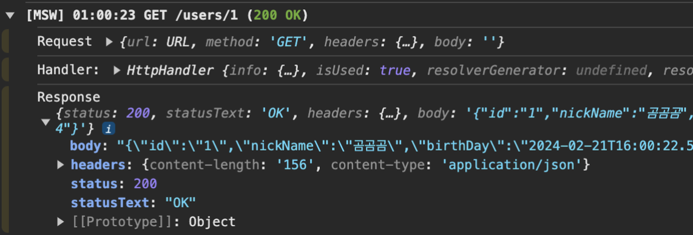
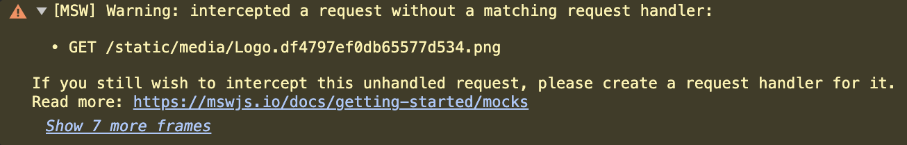
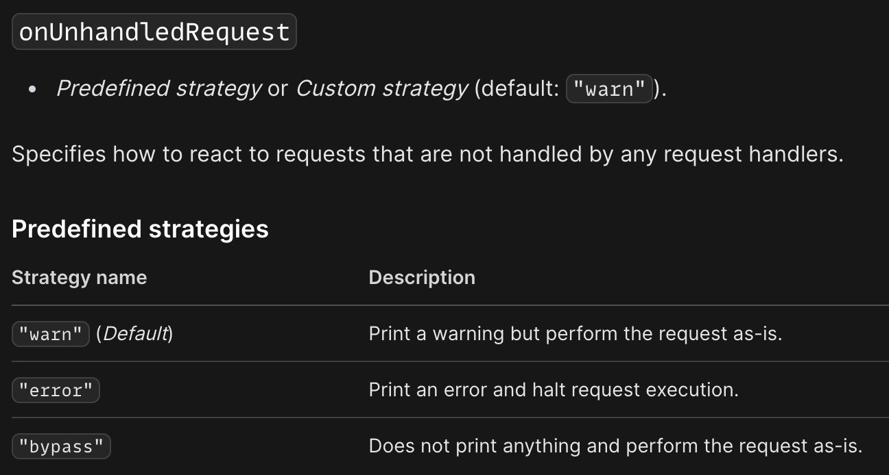
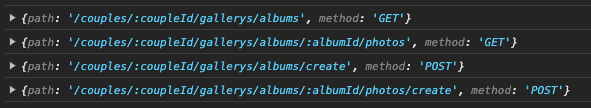
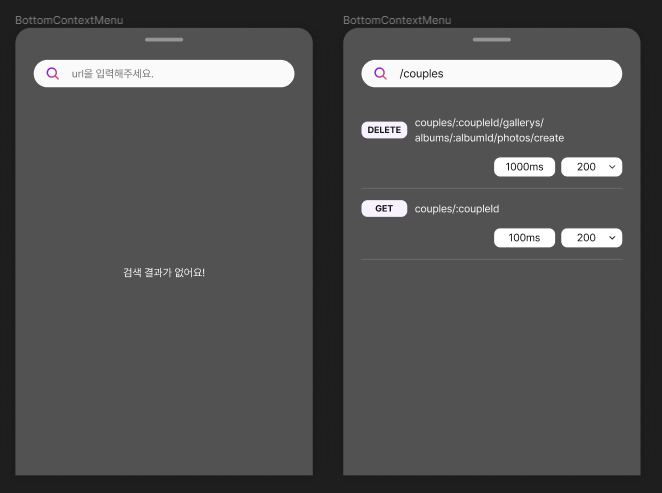
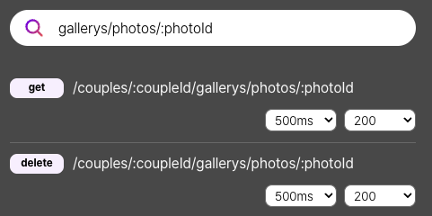
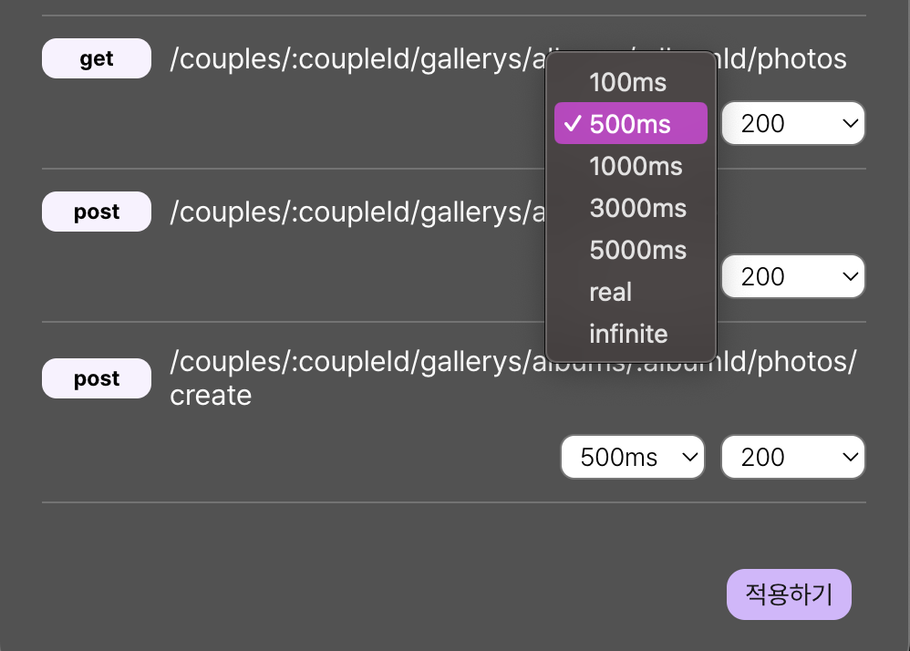

## mocking에 대해 알아보자

### **1. mocking 이란?**

**모킹**은 특정 객체의 실제 구현 대신 가짜 객체를 사용해서 그 객체의 행동을 모방하는 프로세스입니다. 이러한 가짜 객체를 'mock 객체'라고 해요. Mock 객체는 우리의 서비스가 의존하고 있는 외부 시스템이나 복잡한 로직 없이도 동작할 수 있도록 해줍니다. 예를 들어, 서비스에서 사용하고 있는 실제 DB를 거치지 않고 가짜 데이터를 사용하는 것입니다.

### **2. mocking의 이점**

그럼 어떤 이점이 있길래 mocking을 하는 걸까요? mocking의 장점을 3가지로 정리해볼 수 있어요.

1. **외부 서비스나 리소스에 대한 의존성 제거**

   → 외부 API나 데이터베이스와 같은 외부 서비스, 네트워크 지연 등에 영향을 받지 않고 테스트를 수행할 수 있습니다.

2. **어려운 조건과 상황의 시뮬레이션**

   → 네트워크 오류나 데이터베이스 연결 오류 등과 같은 예외 상황이나 희귀한 상황을 임의로 재현해서 특정 상황에서 애플리케이션이 어떻게 동작하는 지 테스트할 수 있습니다.

3. **비용 절감**

   → 테스트를 할 때 실제 서버를 이용하면 서버 비용이 부담이 될 수 있어요. 하지만 mocking을 통해 수행하면 실제 리소스를 사용하지 않으므로 테스트 비용을 절감할 수 있습니다.

### **3. 우리가 모킹을 결정한 이유**

그렇다면 그로잉 프로젝트에서 서버 데이터를 모킹 하기로 한 이유는 무엇일까요?

저희는 비용 문제로 인해 서버를 계속 켜놓을 수 없었어요. 그리고 각 기능별로 에러와 로딩 상황에 대한 UI를 수정할 예정이라 이런 상황들을 빠르게 재현하고 적절히 처리하는데 mocking의 도움을 받으면 좋겠다는 생각을 했어요. 마지막으로, 후에 테스트 코드를 작성할 때 mocking 데이터를 재활용할 수 있다는 점도 저희의 결정에 영향을 줬습니다.

## mocking 도구 비교 분석

### 다른 라이브러리 소개

- **Nock**
  - Node.js 환경에서 HTTP 요청을 mocking하고, 테스팅할 수 있는 강력한 라이브러리에요. 주로 서버 사이드에서 API 호출을 가로채고 대체 응답을 제공하는 데 사용됩니다.
- **Mirage JS**
  - 백엔드 없이도 클라이언트 사이드에서 API를 모의할 수 있게 해주는 라이브러리에요. Mirage는 자체 ORM과 라우터를 제공하여 실제 백엔드 서버를 흉내낼 수 있습니다.
- **JSON Server**
  - 간단한 REST API를 빠르게 프로토타이핑하고자 할 때 유용한 툴로, JSON 파일을 데이터베이스로 사용하여 실제 서버처럼 작동하는 가짜 API 서버를 생성할 수 있습니다.

### 라이브러리 비교

1. **API support**

   |               | MSW | Nock | Mirage                            | JSON server |
   | ------------- | --- | ---- | --------------------------------- | ----------- |
   | REST API      | ✅  | ✅   | ✅                                | ✅          |
   | GraphQL API   | ✅  | ⛔   | 부분 지원(써드파티 애드온을 통해) | ⛔          |
   | WebSocket API | ⛔  | ⛔   | ⛔                                | ⛔          |

2. **Supported environment**

   |         | MSW | Nock | Mirage                                                                             | JSON server                                  |
   | ------- | --- | ---- | ---------------------------------------------------------------------------------- | -------------------------------------------- |
   | Node.js | ✅  | ✅   | 부분 지원(주로 프런트엔드 위주, Node.js는 Mirage의 서버 사이드 렌더링 지원을 통해) | ✅                                           |
   | Browser | ✅  | ⛔   | ✅                                                                                 | ⛔ (프록시 서버를 통해 간접적으로 사용 가능) |

### **MSW만의 특징**

MSW(Mock Service Worker)를 다른 mocking 도구들과 비교하여 채택한 주요 이유는 다음과 같아요.

- **실제 네트워크 환경과의 유사성**
  - MSW는 서비스 워커를 사용하여 실제 네트워크 요청을 가로채고 모의 응답을 제공해요. 이 접근 방식은 개발자가 실제 백엔드와 통신하는 것처럼 코드를 작성할 수 있게 하며, 나중에 실제 API로의 전환을 매끄럽게 해줘요. 다른 도구들이 라이브러리 레벨에서 모의를 제공하는 것과는 대조적으로, MSW는 네트워크 레벨에서 작동하므로 개발 경험이 더욱 실제 서버와 유시헤요.
- **광범위한 테스트 및 개발 환경 지원**
  - MSW는 브라우저 뿐만 아니라 Node.js 환경에서도 작동해요. 또한 Jest와 같은 단위 테스트 프레임워크뿐만 아니라 Cypress, Storybook과 같은 통합 테스트 및 UI 컴포넌트 테스트 환경에서도 사용할 수 있어요. 이는 하나의 모의 설정을 통해 여러 테스팅 환경과 개발 환경에서 일관된 API mocking을 가능하게 도와줍니다.

## 초기 세팅을 해보아요.

우선 사용자 데이터를 불러오는 간단한 API를 MSW를 사용해 연동해볼게요.

### **1. 핸들러 작성하기**

먼저, API 요청을 가로챌 핸들러를 작성해야 합니다.

```tsx
// handlers.ts
import { http, HttpResponse, delay } from "msw"

export const handlers = [
  http.get<GetUserParams, null, UserDto, "/user/:userId">(
    "/user/:userId",
    async ({ params }) => {
      const { userId } = params

      await delay(1000)

      return HttpResponse.json({
        id: userId,
        nickName: "곰곰곰",
        birthDay: "2000-01-01",
        anniversaryDay: "2023-12-16",
      })
    }
  ),
]
```

> HttpResponse 대신 new Response(..) 를 사용할 수도 있지만, HttpResponse가 1) json(),formData() 같은 유용한 메서드를 지원해주고 2) set-cookie를 설정할 수도 있어서 HttpResponse를 사용했어요.

### **2. 브라우저 환경과 통합하기**

MSW를 웹 애플리케이션과 통합하기 위해서는 몇 가지 단계를 더 거쳐야 해요.

1. **Worker script 설치**

   아래 명령어를 실행합니다.

   ```powershell
   npx msw init ./public --save
   ```

2. **Worker 설정**

   MSW Worker를 설정하고 핸들러를 등록합니다.

   ```tsx
   // browser.ts
   import { setupWorker } from "msw/browser"
   import { handlers } from "./handlers"

   export const worker = setupWorker(...handlers)
   ```

3. **Worker 등록 및 실행**

   개발 환경에서만 MSW를 활성화하기 위해 조건을 설정하고, 애플리케이션 실행 전에 Worker를 등록합니다.

   ```tsx
   // msw.ts
   const enableMocking = async () => {
     if (process.env.NODE_ENV !== "development") {
       return
     }

     const { worker } = await import("./mocks/browser")

     return worker.start()
   }

   // index.tsx
   const root = ReactDOM.createRoot(document.getElementById("root"))
   enableMocking().then(() => {
     root
       .render
       // 애플리케이션 컴포넌트
       ()
   })
   ```

### **3. 콘솔에서 확인하기**

애플리케이션을 실행한 후, 개발자 도구의 콘솔에서 MSW가 정상적으로 작동하는지 확인합니다.



잘 작동하네요! 😮😮

### **4. Mocking하지 않은 API 처리하기**

그런데 콘솔에는 많은 경고가 존재하고 있었어요.



이를 알아본 결과, MSW는 정의되지 않은 API 요청을 모두 캐치해 경고를 출력한다고 해요.

<div align='center'>
    
</div>

따라서 onUnhandledRequest 옵션을 bypass로 설정하여 정의되지 않은 API 요청은 무시하도록 설정했어요.

```tsx
worker.start({ onUnhandledRequest: "bypass" })
```

## 폴더 구조를 잡아봅시다.

간단하게 테스트해 본 결과, msw도입을 위해 필요한 파일들은 크게 3가지 종류로 나눌 수 있었어요.

1. API 핸들러
2. Mock 데이터
3. 브라우저 환경에서 실행할 수 있게 도와주는 Worker함수

따라서 각 파일들을 어떤 디렉터리에 위치시킬지 생각해보았어요.

**방법 1: API 경로 기반 구조**

첫번째로 고려한 방식은 API 주소를 기준으로 폴더를 구성하는 방식이에요.

예를 들어 `http://localhost/test/verification`이라는 API를 Mocking한다고 했을 때, 파일구조는 아래와 같이 작성됩니다.

```
src
├── __mocks__/
│   ├── localhost/
│   │   └── test/
│   │       └── verification
│   ├── handlers.ts
│   └── browser.ts
```

**장점은 다음과 같아요.**

- **직관적인 경로:** API 경로를 기반으로 하는 구조는 파일 시스템에서 해당 API를 쉽게 찾을 수 있게 해줍니다. 이는 특히 큰 프로젝트에서 API를 빠르게 찾아 수정해야 할 때 유용해요.
- **변경 관리 용이:** 특정 API에 대한 변경 사항이 있을 때, 관련 파일을 찾아 수정하기가 간편합니다.

**단점은 다음과 같아요.**

- **중복된 구조:** 여러 API가 비슷한 데이터 구조를 공유할 경우, 코드와 mock 데이터의 중복이 발생할 수 있습니다.
- **스케일링 문제:** 프로젝트 규모가 커지면 폴더 구조가 깊어지고 복잡해질 수 있습니다.

**방법 2: Mock 데이터 중심 구조**

두번째로 고려해 본 방식은 Mock 데이터만 별도로 관리하고 핸들러는 한 곳에 모으는 방식입니다.

```
src
├── server/
│   ├── __mocks__/
│   │   └── userList.ts/
│   ├── handlers.ts
│   └── browser.ts
```

**장점은 다음과 같아요.**

- **데이터 중심:** 공통된 데이터 구조를 사용하는 API들이 많은 경우, mock 데이터를 중앙에서 관리함으로써 중복을 줄일 수 있습니다.
- **유연성:** 데이터 변경이 필요할 때 한 곳에서 관리하기 때문에, 데이터의 일관성을 유지하기가 용이합니다.

**단점은 다음과 같아요.**

- **핸들러 관리:** 모든 핸들러를 한 곳에 모으게 되면, 파일이 방대해지고 관리가 어려워질 수 있습니다.
- **데이터와 핸들러의 분리:** 데이터와 핸들러가 분리되어 있어, 관련 핸들러와 데이터 사이의 연결을 파악하기 어려울 수 있습니다.

**방법 3: 도메인별 구조**

세번째로 고려한 방식은 도메인별로 핸들러와 데이터를 모아두는 방식이에요.

```
src
├── mocks/
│   ├── domain/
│   │   └── album/
│   │       ├── data.ts
│   │       └── handlers.ts
│   ├── handlers.ts
│   └── browser.ts
```

**장점은 다음과 같아요.**

- **도메인 중심:** 서비스의 기능별로 구분되어 있어, 관련 기능을 개발할 때 모든 관련 파일을 쉽게 찾을 수 있습니다.
- **유지보수 용이:** 각 도메인별로 핸들러와 데이터를 분리함으로써, 유지보수가 용이합니다. 특정 기능에 문제가 생겼을 때, 해당 도메인의 폴더만 확인하면 됩니다.
- **확장성:** 새로운 기능이나 도메인이 추가될 때, 새로운 폴더를 만들어 그 안에 모든 관련 파일을 배치함으로써 확장성이 높습니다.

**단점은 다음과 같아요.**

- **공통 데이터 관리:** 여러 도메인에서 공통적으로 사용되는 데이터가 있을 경우, 이를 어떻게 관리할지 고민이 필요합니다.
- **API 간 데이터 공유의 어려움:** 특정 도메인에서만 사용되는 데이터가 아닌, 전역적으로 사용되는 데이터의 경우, 어느 도메인에 속해야 할지 결정하기 어려울 수 있습니다.

**그로잉은요?**

그로잉 서비스는 각 기능별로 구분된 도메인이 명확하기 때문에, 3번 방식이 가장 적합하다고 판단했어요.

그리고 기존에 외부 라이브러리는 libs폴더에 정의해두고 사용했지만, msw 관련 파일은 mocks폴더에 전부 모아두기로 했어요. 빌드시 필요없는 코드와 파일들을 한 곳에 몰아넣기 위함이에요.

또한 3번 방식처럼 도메인별 핸들러 함수를 한 파일에 전부 정의해두는 것보다는 분리한 후 index 파일에서 취합해서 내보내기로 했어요. API별 데이터들과 params, 200일때, 400일때 케이스들을 한 파일에 모두 작성하면 코드의 길이가 너무 길어져서 가독성을 해칠 것이라고 판단했기 때문이에요.

따라서 아래와 같이 폴더 구조를 정할 수 있었어요.

```
src
├── mocks/
│   ├── user/
│   │   ├── index.ts
│   │   ├── getUserHandler.ts
│   │   └── anotherHandler.ts
│   ├── handlers.ts // 도메인별 핸들러 함수를 모두 취합하는 곳이에요.
│   ├── browser.ts // worker를 정의해 둔 파일이에요.
│   └── msw.ts // enableMocking() 함수를 정의해 둔 파일이에요.
```

아래는 예시입니다.

```tsx
// mocks/user/getUserHandler.ts
type Params = {
  userId: string
}

const data: UserDto = {
  id: "1",
  nickName: "곰곰곰",
  birthDay: "2000-01-01",
  anniversaryDay: "2023-12-16",
}

export const getUserHandler = () => {
  http.get<Params, null, UserDto, "/user/:userId">(
    "/user/:userId",
    async ({ params }) => {
      const { userId } = params

      await delay(1000)

      return HttpResponse.json(data)
    }
  )
}

// mocks/user/index.ts
import { getUserHandler } from "./getUserHandler"
import { anotherHandler } from "./anotherHandler"

export const UserHandlers = [getUserHandler, anotherHandler]
```

그러나 이 방식은 일부 도메인에는 적용할 수 없었어요.

GET, POST, DELETE 하는 API 가 같은 데이터를 바라봐야 했기 때문이죠. 만약 기존 데이터를 DELETE 요청으로 지운 후에 GET 요청을 했을 때, 지운 데이터가 남아 있다면 테스트할 때 불편하다고 판단했어요.

최최최최종.jpg

따라서 데이터를 공유해야하는 API 들은 한 파일 안에 작성해두는 것으로 변경했어요.

```
src
├── mocks/
│   ├── user/
│   │   ├── getUserHandler.ts // 데이터를 공유할 필요없는 API
│   │   ├── ...
│   │   └── index.ts
│   ├── chat/
│   │   ├── data/
│   │   │   ├── chatData.ts // 공유할 데이터
│   │   │   └── image.png
│   │   ├── chatHandler.ts // 공유할 데이터들을 사용하는 API들
│   │   ├── chatQuestionHandler.ts
│   │   └── index.ts
│   ├── handlers.ts
│   └── browser.ts
```

## 에러 응답 목업은 어떻게 하지? 🤔

애플리케이션은 완벽할 수 없습니다. 네트워크 에러나 우리가 미처 처리하지 못한 예외 등으로 인해 생각한 대로 동작하지 않기도 해요. 그렇기 때문에 성공적인 응답만 mocking하는 것으로는 부족합니다. 이번 절에서는 에러 응답에 대한 모킹 방법에 대해 알아볼게요.

### MSW **공식 문서 살펴보기**

MSW의 공식 문서에서 다음과 같은 에러 응답 목업 방식에 대해 찾을 수 있었어요.

- status code 설정하기

  ```jsx
  export const handlers = [
    http.delete("/posts/:id", ({ params }) => {
      const { id } = params
      const deletedPost = allPosts.get(id)

      if (!deletedPost) {
        return new HttpResponse(null, { status: 404 })
      }

      allPosts.delete(id)

      return HttpResponse.json(deletedPost)
    }),
  ]
  ```

  → 조건에 따라 에러를 나타내는 status를 함께 반환하는 방식이에요.

- Network Error

  ```jsx
  import { http, HttpResponse } from "msw"

  export const handlers = [
    http.get("/resource", () => {
      return HttpResponse.error()
    }),
  ]
  ```

  → 네트워크 에러의 경우 위와 같이 HttpResponse.error()를 반환해요.

- dynamic mock scenarios

  ```jsx
  import { http, HttpResponse } from "msw"

  export const scenarios = {
    success: [
      http.get("/user", () => {
        return HttpResponse.json({ name: "minju" })
      }),
    ],
    error: [
      http.get("/user", () => {
        return new HttpResponse(null, { status: 500 })
      }),
    ],
  }
  ```

  → 응답에 성공하는 경우와, 에러인 경우를 시나리오로 작성할 수 있어요. url 뒤에 `?scenario=error` 을 붙이면 오류 응답을 반환하는 경우에 어떻게 작동하는지 런타임에서 확인할 수 있어요.

### 그로잉에서 선택한 에러 목업

저희는 런타임에서 여러 기능들의 성공과 실패의 조합에 따라 테스트를 할 수 있는 방식이 필요했어요. msw에서 제공해주는 dynamic mock scenarios를 사용해 이를 구현하려면 url이 바뀌여야 하고, 한 페이지에 있는 여러 기능에 대해 각 시나리오를 식별하도록 코드를 추가로 작성해야 합니다. 그래서 저희는 status code를 런타임에 다르게 설정하는 방식을 사용하기로 했고, 여러 조합을 편하게 테스트할 수 있게 도와주는 툴바를 제작하기로 했어요.

## 툴바를 만들자!

### 정의된 핸들러 리스트 받아오기

툴바 구현을 위해 먼저 정의해 둔 핸들러 리스트 정보들을 가져올 수 있는 지가 가장 중요했어요. 따라서 해당 정보를 받아올 수 있는지 확인하는 작업을 먼저 진행했어요.

```tsx
// App.ts
import { handlers } from "mocks/handlers"

// 각 핸들러의 경로와 메소드 정보를 콘솔에 출력
handlers.forEach(handler => {
  const { path, method } = handler.info // 핸들러의 정보에서 경로와 메소드 추출
  console.log({ path, method })
})
```

다행히도 MSW 핸들러에서 제공하는 정보를 활용하여, 간단한 코드 몇 줄로 원하는 핸들러 정보를 추출할 수 있었어요.


이렇게 콘솔에 출력된 정보를 바탕으로, 핸들러 정보를 관리하는 클래스나 객체를 구성하여 필요할 때마다 활용하면 될 것 같네요!

### UI

툴바의 UI는 피그마를 사용하여 디자인했습니다. 툴바에 포함될 주요 기능은 다음과 같아요.

1. **API 경로 검색**: 사용자가 특정 API 경로를 검색하여 해당하는 핸들러를 찾을 수 있습니다.
2. **상태 코드 변경**: 성공 또는 에러 상태 코드를 동적으로 변경할 수 있어, 다양한 응답 시나리오를 시뮬레이션할 수 있습니다.
3. **응답 지연 설정**: API 응답의 지연 시간을 설정하여 네트워크 지연 테스트를 할 수 있습니다.



### **핸들러 동적 변경 고려사항**

상태 코드나 응답 지연 시간을 변경하려면, 기존의 핸들러 코드를 동적으로 조절할 필요가 있었어요. 예를 들어, 성공 응답과 에러 응답을 다루는 두 가지 핸들러가 있다고 가정해 보겠습니다.

```tsx
// mocks/user/getUserHandler.ts
type Params = {
  userId: string;
};

const data: UserDto = {
	id: '1',
	nickName: '곰곰곰',
	birthDay: '2000-01-01',
	anniversaryDay: '2023-12-16',
};

// 성공 응답 핸들러
export const getUserSuccessHandler = () => {
	http.get<Params, null, UserDto, '/user/:userId'>(
    '/user/:userId',
    async () => {
			await delay(1000); // 1초 지연

      return HttpResponse.json(data, {
	      status: 200,
	      statusText: '요청에 상공했습니다.',
		});
  });
}

export const getUserErrorHandler = () => {
	http.get<Params, null, null, '/user/:userId'>(
    '/user/:userId',
    async () => {
			await delay(500); // 0.5초 지연

      return HttpResponse.json(null, {
	      status: 400,
	      statusText: '요청에 실패했습니다.',
    }),
  });
}
```

세 부분에서 변경이 일어나는 것을 알 수 있어요.

1. **응답 타입**: 성공과 실패 응답의 타입이 다를 수 있습니다.
2. **지연 시간**: `delay` 함수의 인자를 통해 응답 지연 시간을 설정합니다.
3. **응답 데이터**: `HttpResponse.json` 메소드의 인자로 전달되는 데이터입니다.

따라서 이 요소들을 런타임에 동적으로 바꿔줄 수 있어야 했어요. 이를 하드코딩이 아닌 변수로 지정해두고 동적으로 바꿔주면 될 것 같아요.

### 해당하는 URL에 맞는 핸들러 찾는 법

그렇다면 검색한 API URL에 맞는 핸들러는 어떻게 찾을 수 있을까요?

같은 URL에 대해 다른 HTTP 메소드(GET, POST, DELETE 등)를 사용하는 경우가 많기 때문에, 단순히 URL만으로 핸들러를 찾는 것은 충분하지 않았아요.

이를 해결하기 위해 핸들러 정보를 저장할 때 URL 경로와 HTTP 메소드의 조합을 고유한 식별자로 사용하기로 결정했어요.

```tsx
interface HandlerInfoList {
  [path: string]: {
    [method: string]: HandlerInfo
  }
}
```



### HandlerInfoManager 구현과 활용

핸들러들을 저장하고 꺼내오고 delay 변수값들을 변경시켜주는 작업을 저희 그로잉 팀은 HandlerInfoManager 클래스를 제작하여 해결하였어요.

```tsx
import { handlers } from "mocks/handlers"

const DEFAULT_STATUS = 200
const DEFAULT_DELAY = 1000

type StatusType = 200 | 400

interface HandlerInfo {
  status: StatusType
  delayTime: number
}

interface HandlerInfoList {
  [path: string]: {
    [method: string]: HandlerInfo
  }
}

interface HandlerInfoParams {
  path: string
  method: string
  code: StatusType
  time: number
}

class HandlerInfoManager {
  private handlerInfos: HandlerInfoList = {}

  // 핸들러 정보 초기화
  public initHandlerInfo(): void {
    handlers.forEach(handler => {
      const { path, method } = handler.info
      this.setHandlerInfo({
        path: path.toString(),
        method: method.toString(),
        code: 200, // 기본 상태 코드
        time: 1000, // 기본 지연 시간
      })
    })
  }

  // 핸들러 정보 설정
  public setHandlerInfo({ path, method, code, time }: HandlerInfoParams): void {
    if (!this.handlerInfos[path]) {
      this.handlerInfos[path] = {}
    }
    this.handlerInfos[path][method] = { status: code, delayTime: time }
  }

  // 핸들러 리스트 조회
  public getHandlerInfos(): HandlerInfoList {
    return this.handlerInfos
  }

  // 특정 핸들러 정보 조회
  public getHandlerInfo(path: string, method: string): HandlerInfo | undefined {
    return this.handlerInfos[path]?.[method]
  }
}

export const handlerInfoManager = new HandlerInfoManager()
```

이렇게 `HandlerInfoManager`를 사용하면 핸들러의 상태 코드와 지연 시간을 런타임에 변경할 수 있으며, 툴바 UI에서 사용자의 입력에 따라 이러한 변경을 적용할 수 있습니다.

### 사용 예시

사용 예시는 다음과 같아요.

```tsx
import { handlerInfoManager } from "mocks/HandlerInfoManager"
import { CoupleDto } from "models/couple"
import { delay, http, HttpResponse } from "msw"

interface Params {
  coupleId: string
}

const data: CoupleDto = {
  coupleId: "1",
  myName: "연주",
  partnerName: "민지",
  dayCount: 10,
  petId: null,
}

export const getCoupleHandler = http.get<Params, {}, CoupleDto | null>(
  "/couples/:coupleId",
  async () => {
    const responseList = {
      200: HttpResponse.json(data, {
        status: 200,
        statusText: "success",
      }),
      400: HttpResponse.json(null, {
        status: 400,
        statusText: "fail",
      }),
    }

    const handler = handlerInfoManager.getHandlerInfo(
      "/couples/:coupleId",
      "GET"
    )

    const status = handler?.status || 200
    const delayTime = handler?.delayTime || 0

    await delay(delayTime)
    return responseList[status]
  }
)
```

```tsx
const handleClick = (path: string, method: string) => {
  handlerInfoManager.setHandlerInfo({ path, method, code: 400, time: 3000 })
}
```

### 추상화를 해보자

모든 API 핸들러에서 반복적으로 나타나는 패턴들은 무엇이 있을까요?

다음 코드가 반복해서 작성되어야 했어요. 이를 추상화하여 코드 중복을 줄여볼게요.

```tsx
const handler = handlerInfoManager.getHandlerInfo("/couples/:coupleId", "GET")

const status = handler?.status || 200
const delayTime = handler?.delayTime || 0

await delay(delayTime)
return responseList[status]
```

```tsx
import { handlerInfoManager } from "mocks/HandlerInfoManager"
import { delay, http } from "msw"

// 상태 코드별 응답 데이터를 매핑하는 객체 타입을 정의합니다.
type ResponseData<TResponse> = {
  [key: number]: TResponse | null
}

// API 요청 처리 함수 타입을 정의합니다.
type RequestHandler<TParams, TResponse> = (
  params: TParams
) => ResponseData<TResponse>

// 범용 API 핸들러 생성 함수를 정의합니다.
export const createApiHandler = <TParams, TResponse>(
  path: string,
  method: keyof typeof http,
  handleRequest: RequestHandler<TParams, TResponse>
) => {
  return http[method](path, async req => {
    const params = req.params as TParams
    const handler = handlerInfoManager.getHandlerInfo(path, method)
    const delayTime = handler?.delayTime || 0
    const responseStatus = handler?.status || 200

    await delay(delayTime)

    const responseData = handleRequest(params)
    return responseData[responseStatus]
  })
}
```

이 추상화를 통해 아래처럼 간편하게 개별 핸들러들을 구현할 수 있게 되었어요. 각 API 핸들러마다 상태 코드와 지연 시간을 처리하는 로직을 반복해서 작성할 필요가 없어진거죠.

```tsx
// 사용 예시: 커플 정보 조회 API 핸들러
interface Params {
  coupleId: string
}

const data: CoupleDto = {
  coupleId: "1",
  myName: "연주",
  partnerName: "민지",
  dayCount: 10,
  petId: "1",
}

export const getCoupleHandler = createApiHandler<Params, CoupleDto | null>(
  "/couples/:coupleId",
  "get",
  () => ({
    // 여기서는 단순화를 위해 바로 데이터를 반환하지만,
    // 실제로는 params를 기반으로 데이터를 조회하거나 처리할 수 있습니다.
    200: data, // 성공 응답
    400: null, // 실패 응답
  })
)
```

## 그러나,,

처음에 생각한 기능들 외에 추가로 필요한 기능들이 있었어요. 처음에는 Path Parameter만 필요했었지만 Query Parameter가 필요한 경우도 있었어요.

> Parameter type
>
> 1. Query parameters: `?a=1&b=2`;
> 2. Path parameters: `GET /user/:id`, where `id` is a path parameter.

그리고 API 호출 성공 후에 로직을 처리할 콜백 함수가 필요했어요. DELETE 요청 후에 기존 data를 삭제하거나, PATCH 후에 수정하는 코드가 필요했기 때문이에요.

이러한 추가 요구사항을 충족하기 위해 다음과 같이 `createApiHandler` 함수를 확장했어요.

```tsx
// ApiHandlerCreator.ts
import { DefaultBodyType, PathParams, delay, http, HttpResponse, StrictRequest } from 'msw';
import { handlerInfoManager } from './HandlerInfoManager';

// 응답 데이터 타입 정의: 상태 코드별로 응답 데이터를 매핑
type ResponseData<TResponse> = {
  [status: number]: NullableResponse<TResponse>;
};

// 요청 처리 핸들러 타입 정의: 경로 및 요청 매개변수를 받아 응답 데이터를 반환
type RequestHandler<TParams, TRequest, TResponse> = (
  params: TParams,
  request: TRequest
) => ResponseData<TResponse>;

// 요청 처리 후 실행할 콜백 함수 타입 정의
type AfterRequest<TParams, TRequest> = (
  params: TParams,
  request: TRequest
) => void;

// 범용 API 핸들러 생성 함수
export const createApiHandler = <
  TParams extends PathParams,
  TRequest extends DefaultBodyType,
  TResponse extends DefaultBodyType
>(
  path: string;
  method: keyof typeof http;
  requestHandler: RequestHandler<TParams, StrictRequest<TRequest>, TResponse>;
  onSuccess?: AfterRequest<TParams, StrictRequest<TRequest>>;
  ) => {
  return http[method]<TParams, TRequest, TResponse>(
    path,
    async ({ params, request }) => {
      // 요청 처리 함수를 호출하여 응답 데이터를 가져옴
      const responseData = requestHandler(params, request);

      // 핸들러 정보(응답 지연 시간 및 상태 코드) 조회
      const handlerInfo = handlerInfoManager.getHandlerInfo(path, method);
      const delayTime = handlerInfo?.delayTime || 0;
      const responseStatus = handlerInfo?.status || 200;

      // 응답 지연 시간 적용
      await delay(delayTime);

      // 성공적인 요청 처리 후 콜백 함수 실행
      if (responseStatus !== 400) {
        onSuccess?.(params, request);
      }

      // JSON 형태로 응답 반환
      return HttpResponse.json(responseData[responseStatus], {
        status: responseStatus,
      });
    }
  );
};
```

### 리팩토링: 파라미터 객체화

함수의 매개변수가 많아짐에 따라 가독성과 사용성 문제가 발생했어요. 몇번째 파라미터에 어떤 값을 넣어줘야 할지 시각적으로 알아보기 어려웠기 때문이에요.

이를 해결하기 위해 "객체 비구조화 할당(destructuring)" 기법을 적용하여 함수 매개변수를 객체화했습니다. 이 접근 방식을 통해 함수 호출 시 매개변수의 순서에 덜 의존할 수 있게 되었고, 코드의 가독성을 향상시킬 수 있었어요.

```tsx
// 변경전
export const deleteOurChatHandler = createApiHandler<
  ChatDeleteParams,
  {},
  null
>(
  "/couples/:coupleId/chattings/:chattingId/delete-ours",
  "delete",
  () => ({
    200: null,
    400: null,
  }),
  ({ chattingId }) => {
    chatData = chatData.filter(chat => chat.parentChatting.id !== chattingId)
  }
)
```

```tsx
// 변경후
export const deleteOurChatHandler = createApiHandler<
  ChatDeleteParams,
  {},
  null
>({
  path: "/couples/:coupleId/chattings/:chattingId/delete-ours",
  method: "delete",
  requestHandler: () => ({
    200: null,
    400: null,
  }),
  onSuccess: ({ chattingId }) => {
    chatData = chatData.filter(chat => chat.parentChatting.id !== chattingId)
  },
})
```

### MSW 툴바 컴포넌트 제작하기

이제 툴바 컴포넌트를 제작해 볼게요.

```tsx
//MSWToolbar.tsx
import ...

function MSWToolbar() {
  const queryClient = useQueryClient();

  const [open, setOpen] = useState(false);
  const [items, setItems] = useState(
    Object.entries(handlerInfoManager.getHandlerInfos())
  );
  const stagedValue = useRef<{
    [key: string]: SetHandlerParams;
  }>({});

  const inputChangeHandler = (e: React.ChangeEvent<HTMLInputElement>) => {
    const { value } = e.target;
    setItems(
      Object.entries(handlerInfoManager.getHandlerInfos()).filter(([path]) =>
        path.includes(value)
      )
    );
  };

  const clickApplyBtnHandler = () => {
    Object.keys(stagedValue.current).forEach((path) => {
      const { method, code, time } = stagedValue.current[path];
      handlerInfoManager.setHandlerInfo({ path, method, code, time });
    });
    queryClient.invalidateQueries();
    setOpen(false);
  };

  return (
    <>
      {!open && (
        <S.ToolbarButton onClick={() => setOpen(true)}>MSW</S.ToolbarButton>
      )}

      {open && (
        <ToolbarBottomSheet open={open} setOpen={setOpen}>
          <S.SearchBar>
            <Icon icon="IconSearch" />
            <S.Input onChange={inputChangeHandler} />
          </S.SearchBar>

          {items.length === 0 && (
            <S.MessageBox>검색 결과가 없어요!</S.MessageBox>
          )}

          {items.length > 0 && (
            <S.ItemsContainer className="hidden-scrollbar">
              {items.flatMap(([path, methods]) =>
                Object.entries(methods).map(
                  ([method, { delayTime, status }]) => (
                    <ToolbarItem
                      key={`${path}-${method}`}
                      method={method}
                      path={path}
                      delayTime={delayTime}
                      status={status}
                      onChange={(time, code) => {
                        stagedValue.current[path] = {
                          path,
                          method,
                          code,
                          time,
                        };
                      }}
                    />
                  )
                )
              )}
            </S.ItemsContainer>
          )}

          {items.length > 0 && (
            <S.ButtonArea>
              <S.Button onClick={clickApplyBtnHandler}>적용하기</S.Button>
            </S.ButtonArea>
          )}
        </ToolbarBottomSheet>
      )}
    </>
  );
}

export default MSWToolbar;
```

<div align='center'>

</div>

툴바 컴포넌트의 전체 코드와 툴바의 옵션 선택 부분입니다. 코드의 동작 과정을 자세히 살펴볼게요.

- `handlerInfoManager.getHandlerInfos()` 를 사용해 handler의 path와 method를 받아오고 있어요.
- `inputChangeHandler` 는 검색 창의 input value가 변경되었을 때 호출되는 함수에요. 텍스트를 입력할 때마다 입력된 경로가 포함되는 요소들을 보여줍니다.
- 각 핸들러에 대응되는 드롭다운 메뉴에서 옵션을 선택하면, 옵션을 stagedValue 변수에 저장합니다.
- 적용하기 버튼을 누르면, `clickApplyBtnHandler` 가 실행되어 stagedValue에 저장된 옵션들(delay와 status code)이 실제 핸들러에 적용됩니다. 현재 그로잉 프로젝트에서는 react-query를 사용하고 있어서 옵션들을 적용한 후 바로 데이터를 refetch하도록 만들기 위해 마지막으로 `queryClient.invalidateQueries()` 를 실행해주고 있어요.
- real은 현실적인 응답 시간 정도를 지연해주는 옵션입니다. infinite는 응답을 무한하게 delay 시켜주는 옵션입니다. 이는 로딩 상태가 잘 표시되는 지 등을 확인할 때 유용하게 사용할 수 있어요.

코드에서 한 가지 생각해볼 점이 있었어요.

`const stagedValue = useRef<{[key: string]: SetHandlerParams;}>({});` 부분에서 왜 useRef 훅을 사용했을까요? stagedValue를 useRef없이 사용하면, 검색을 할 때마다 MSWToolbar 컴포넌트가 재실행 되어 stagedValue가 빈 객체로 초기화됩니다. 이를 방지하고자 useState 훅을 사용하면, stagedValue가 변경 될 때마다 리렌더링이 발생해요. 그래서 컴포넌트가 재실행 되더라도 stagedValue값을 유지하면서, stagedValue가 변경되더라도 리렌더링이 일어나지 않게 하기 위해 useRef hook을 사용했어요.

### 툴바는 리액트 돔 트리에서 어디에 위치해야 할까?

```tsx
const root = ReactDOM.createRoot(document.getElementById("root") as HTMLElement)

enableMocking().then(() => {
  root.render(
    <React.StrictMode>
      <BrowserRouter>
        <QueryClientProvider client={queryClient}>
          <ReactQueryDevtools initialIsOpen={false} />
          <GlobalStyle />
          <ThemeProvider theme={myTheme}>
            {process.env.NODE_ENV === "development" && <MSWToolbar />}
            <AsyncBoundary
              pendingFallback={<FullScreenLoading />}
              rejectedFallback={({ error, resetErrorBoundary }) => (
                <FullScreenError
                  error={error}
                  resetErrorBoundary={resetErrorBoundary}
                />
              )}
            >
              <App />
            </AsyncBoundary>
          </ThemeProvider>
        </QueryClientProvider>
      </BrowserRouter>
    </React.StrictMode>
  )
})
```

다음은 MSWToolbar 컴포넌트의 위치를 선택할 때 고려한 내용들이에요.

1. MSWToolbar는 dev모드에서만 뜨도록 해야 합니다.
2. MSWToolbar는 런타임에 영향을 주지 않아야 합니다.
3. MSWToolbar에서 styled-component의 theme을 이용하고 있어 ThemeProvider 안에 들어가야 합니다.
4. react query로 관리되고 있는 서버 데이터의 invalidate해줄 수 있어야 하므로 QueryClientProvider 안에 들어가야 합니다.

1번을 위해 NODE_ENV에 따라 Toolbar를 표시해 주었고, 2번,3번을 고려해 AsyncBoundary밖이면서 ThemeProvider와 QueryClientProvider의 안에 위치 시켰어요. MSWToolbar를 이용해 의도적으로 error 상황을 테스트할 때, 그로잉 프로젝트에서 AsyncBoudary와 함께 사용하고 있는 FullScreenError가 뜰 수 있어요. 이때, MSWToolbar는 런타임에서 발생하는 에러 범위 밖에서 상태코드를 200으로 바꿔줄 수 있어야 하기 때문에 AsyncBoundary밖에 있어야 해요.

## 최종 완성

### 시연영상

<div align='center'>
    
</div>

## 결론

MSW와 MSW를 활용한 툴바의 도입을 성공했습니다. 도입 전에는 로딩 상태 확인을 위해 크롬 devtools를 활용했는데 툴바를 활용해 런타임에서 쉽게 delay를 조정할 수 있게 되었습니다. 그리고 에러가 발생하는 상황을 쉽게 재현하고, 다시 응답에 성공하도록 되돌리는 것도 간편해졌습니다.

MSW를 사용한 모킹은 api path를 기준으로 이루어지기 때문에 매우 직관적이고 코드 작성도 쉬웠던 것 같습니다.
