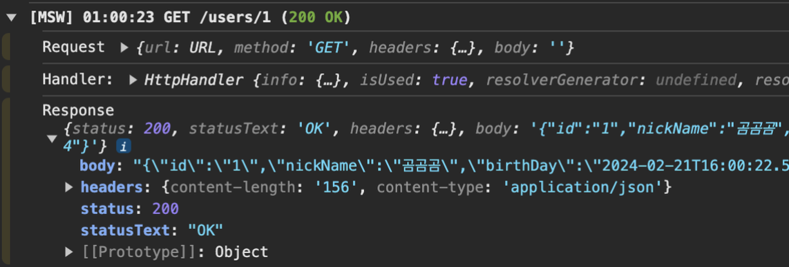
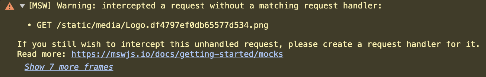
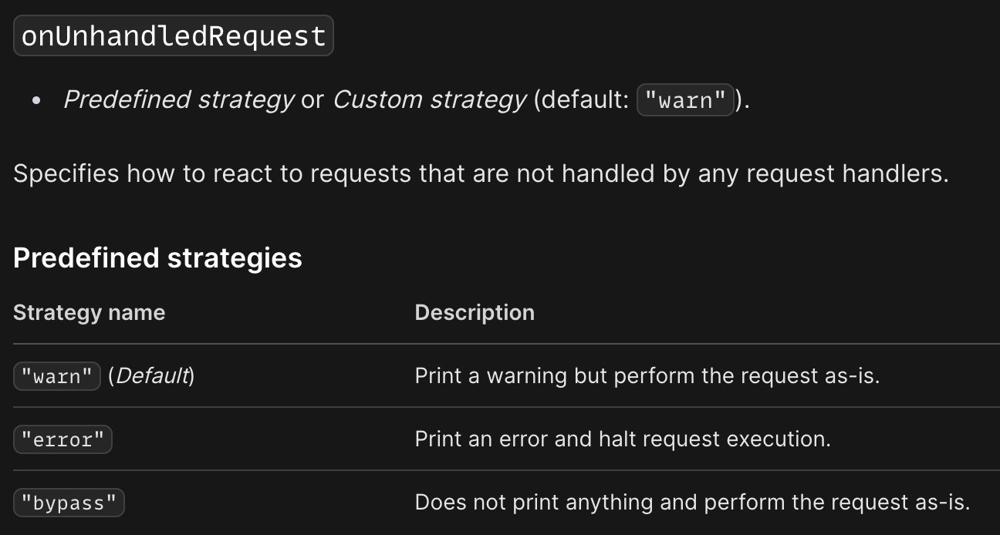

## mocking에 대해 알아보자

### **1. mocking 이란?**

**모킹**은 특정 객체의 실제 구현 대신 가짜 객체를 사용해서 그 객체의 행동을 모방하는 프로세스입니다. 이러한 가짜 객체를 'mock 객체'라고 해요. Mock 객체는 우리의 서비스가 의존하고 있는 외부 시스템이나 복잡한 로직 없이도 동작할 수 있도록 해줍니다. 예를 들어, 서비스에서 사용하고 있는 실제 DB를 거치지 않고 가짜 데이터를 사용하는 것입니다.

### **2. mocking의 이점**

그럼 어떤 이점이 있길래 mocking을 하는 걸까요? mocking의 장점을 3가지로 정리해볼 수 있어요.

1. **외부 서비스나 리소스에 대한 의존성 제거**

   → 외부 API나 데이터베이스와 같은 외부 서비스, 네트워크 지연 등에 영향을 받지 않고 테스트를 수행할 수 있습니다.

2. **어려운 조건과 상황의 시뮬레이션**

   → 네트워크 오류나 데이터베이스 연결 오류 등과 같은 예외 상황이나 희귀한 상황을 임의로 재현해서 특정 상황에서 애플리케이션이 어떻게 동작하는 지 테스트할 수 있습니다.

3. **비용 절감**

   → 테스트를 할 때 실제 서버를 이용하면 서버 비용이 부담이 될 수 있어요. 하지만 mocking을 통해 수행하면 실제 리소스를 사용하지 않으므로 테스트 비용을 절감할 수 있습니다.

### **3. 우리가 모킹을 결정한 이유**

그렇다면 그로잉 프로젝트에서 서버 데이터를 모킹 하기로 한 이유는 무엇일까요?

저희는 비용 문제로 인해 서버를 계속 켜놓을 수 없었어요. 그리고 각 기능별로 에러와 로딩 상황에 대한 UI를 수정할 예정이라 이런 상황들을 빠르게 재현하고 적절히 처리하는데 mocking의 도움을 받으면 좋겠다는 생각을 했어요. 마지막으로, 후에 테스트 코드를 작성할 때 mocking 데이터를 재활용할 수 있다는 점도 저희의 결정에 영향을 줬습니다.

## mocking 도구 비교 분석

### 다른 라이브러리 소개

- **Nock**
  - Node.js 환경에서 HTTP 요청을 mocking하고, 테스팅할 수 있는 강력한 라이브러리에요. 주로 서버 사이드에서 API 호출을 가로채고 대체 응답을 제공하는 데 사용됩니다.
- **Mirage JS**
  - 백엔드 없이도 클라이언트 사이드에서 API를 모의할 수 있게 해주는 라이브러리에요. Mirage는 자체 ORM과 라우터를 제공하여 실제 백엔드 서버를 흉내낼 수 있습니다.
- **JSON Server**
  - 간단한 REST API를 빠르게 프로토타이핑하고자 할 때 유용한 툴로, JSON 파일을 데이터베이스로 사용하여 실제 서버처럼 작동하는 가짜 API 서버를 생성할 수 있습니다.

### 라이브러리 비교

1. **API support**

   |               | MSW | Nock | Mirage                            | JSON server |
   | ------------- | --- | ---- | --------------------------------- | ----------- |
   | REST API      | ✅  | ✅   | ✅                                | ✅          |
   | GraphQL API   | ✅  | ⛔   | 부분 지원(써드파티 애드온을 통해) | ⛔          |
   | WebSocket API | ⛔  | ⛔   | ⛔                                | ⛔          |

2. **Supported environment**

   |         | MSW | Nock | Mirage                                                                             | JSON server                                  |
   | ------- | --- | ---- | ---------------------------------------------------------------------------------- | -------------------------------------------- |
   | Node.js | ✅  | ✅   | 부분 지원(주로 프런트엔드 위주, Node.js는 Mirage의 서버 사이드 렌더링 지원을 통해) | ✅                                           |
   | Browser | ✅  | ⛔   | ✅                                                                                 | ⛔ (프록시 서버를 통해 간접적으로 사용 가능) |

### **MSW만의 특징**

MSW(Mock Service Worker)를 다른 mocking 도구들과 비교하여 채택한 주요 이유는 다음과 같아요.

- **실제 네트워크 환경과의 유사성**
  - MSW는 서비스 워커를 사용하여 실제 네트워크 요청을 가로채고 모의 응답을 제공해요. 이 접근 방식은 개발자가 실제 백엔드와 통신하는 것처럼 코드를 작성할 수 있게 하며, 나중에 실제 API로의 전환을 매끄럽게 해줘요. 다른 도구들이 라이브러리 레벨에서 모의를 제공하는 것과는 대조적으로, MSW는 네트워크 레벨에서 작동하므로 개발 경험이 더욱 실제 서버와 유시헤요.
- **광범위한 테스트 및 개발 환경 지원**
  - MSW는 브라우저 뿐만 아니라 Node.js 환경에서도 작동해요. 또한 Jest와 같은 단위 테스트 프레임워크뿐만 아니라 Cypress, Storybook과 같은 통합 테스트 및 UI 컴포넌트 테스트 환경에서도 사용할 수 있어요. 이는 하나의 모의 설정을 통해 여러 테스팅 환경과 개발 환경에서 일관된 API mocking을 가능하게 도와줍니다.

## 초기 세팅을 해보아요.

우선 사용자 데이터를 불러오는 간단한 API를 MSW를 사용해 연동해볼게요.

### **1. 핸들러 작성하기**

먼저, API 요청을 가로챌 핸들러를 작성해야 합니다.

```tsx
// handlers.ts
import { http, HttpResponse, delay } from "msw"

export const handlers = [
  http.get<GetUserParams, null, UserDto, "/user/:userId">(
    "/user/:userId",
    async ({ params }) => {
      const { userId } = params

      await delay(1000)

      return HttpResponse.json({
        id: userId,
        nickName: "곰곰곰",
        birthDay: "2000-01-01",
        anniversaryDay: "2023-12-16",
      })
    }
  ),
]
```

> HttpResponse 대신 new Response(..) 를 사용할 수도 있지만, HttpResponse가 1) json(),formData() 같은 유용한 메서드를 지원해주고 2) set-cookie를 설정할 수도 있어서 HttpResponse를 사용했어요.

### **2. 브라우저 환경과 통합하기**

MSW를 웹 애플리케이션과 통합하기 위해서는 몇 가지 단계를 더 거쳐야 해요.

1. **Worker script 설치**

   아래 명령어를 실행합니다.

   ```powershell
   npx msw init ./public --save
   ```

2. **Worker 설정**

   MSW Worker를 설정하고 핸들러를 등록합니다.

   ```tsx
   // browser.ts
   import { setupWorker } from "msw/browser"
   import { handlers } from "./handlers"

   export const worker = setupWorker(...handlers)
   ```

3. **Worker 등록 및 실행**

   개발 환경에서만 MSW를 활성화하기 위해 조건을 설정하고, 애플리케이션 실행 전에 Worker를 등록합니다.

   ```tsx
   // msw.ts
   const enableMocking = async () => {
     if (process.env.NODE_ENV !== "development") {
       return
     }

     const { worker } = await import("./mocks/browser")

     return worker.start()
   }

   // index.tsx
   const root = ReactDOM.createRoot(document.getElementById("root"))
   enableMocking().then(() => {
     root
       .render
       // 애플리케이션 컴포넌트
       ()
   })
   ```

### **3. 콘솔에서 확인하기**

애플리케이션을 실행한 후, 개발자 도구의 콘솔에서 MSW가 정상적으로 작동하는지 확인합니다.



잘 작동하네요! 😮😮

### **4. Mocking하지 않은 API 처리하기**

그런데 콘솔에는 많은 경고가 존재하고 있었어요.



이를 알아본 결과, MSW는 정의되지 않은 API 요청을 모두 캐치해 경고를 출력한다고 해요.

<div align='center'>
    
</div>

따라서 onUnhandledRequest 옵션을 bypass로 설정하여 정의되지 않은 API 요청은 무시하도록 설정했어요.

```tsx
worker.start({ onUnhandledRequest: "bypass" })
```

## 폴더 구조를 잡아봅시다.

간단하게 테스트해 본 결과, msw도입을 위해 필요한 파일들은 크게 3가지 종류로 나눌 수 있었어요.

1. API 핸들러
2. Mock 데이터
3. 브라우저 환경에서 실행할 수 있게 도와주는 Worker함수

따라서 각 파일들을 어떤 디렉터리에 위치시킬지 생각해보았어요.

### 방법 1: API 경로 기반 구조

첫번째로 고려한 방식은 API 주소를 기준으로 폴더를 구성하는 방식이에요.

예를 들어 `http://localhost/test/verification`이라는 API를 Mocking한다고 했을 때, 파일구조는 아래와 같이 작성됩니다.

```
src
├── __mocks__/
│   ├── localhost/
│   │   └── test/
│   │       └── verification
│   ├── handlers.ts
│   └── browser.ts
```

**장점은 다음과 같아요.**

- **직관적인 경로:** API 경로를 기반으로 하는 구조는 파일 시스템에서 해당 API를 쉽게 찾을 수 있게 해줍니다. 이는 특히 큰 프로젝트에서 API를 빠르게 찾아 수정해야 할 때 유용해요.
- **변경 관리 용이:** 특정 API에 대한 변경 사항이 있을 때, 관련 파일을 찾아 수정하기가 간편합니다.

**단점은 다음과 같아요.**

- **중복된 구조:** 여러 API가 비슷한 데이터 구조를 공유할 경우, 코드와 mock 데이터의 중복이 발생할 수 있습니다.
- **스케일링 문제:** 프로젝트 규모가 커지면 폴더 구조가 깊어지고 복잡해질 수 있습니다.

### 방법 2: Mock 데이터 중심 구조

두번째로 고려해 본 방식은 Mock 데이터만 별도로 관리하고 핸들러는 한 곳에 모으는 방식입니다.

```
src
├── server/
│   ├── __mocks__/
│   │   └── userList.ts/
│   ├── handlers.ts
│   └── browser.ts
```

**장점은 다음과 같아요.**

- **데이터 중심:** 공통된 데이터 구조를 사용하는 API들이 많은 경우, mock 데이터를 중앙에서 관리함으로써 중복을 줄일 수 있습니다.
- **유연성:** 데이터 변경이 필요할 때 한 곳에서 관리하기 때문에, 데이터의 일관성을 유지하기가 용이합니다.

**단점은 다음과 같아요.**

- **핸들러 관리:** 모든 핸들러를 한 곳에 모으게 되면, 파일이 방대해지고 관리가 어려워질 수 있습니다.
- **데이터와 핸들러의 분리:** 데이터와 핸들러가 분리되어 있어, 관련 핸들러와 데이터 사이의 연결을 파악하기 어려울 수 있습니다.

### 방법 3: 도메인별 구조

세번째로 고려한 방식은 도메인별로 핸들러와 데이터를 모아두는 방식이에요.

```
src
├── mocks/
│   ├── domain/
│   │   └── album/
│   │       ├── data.ts
│   │       └── handlers.ts
│   ├── handlers.ts
│   └── browser.ts
```

**장점은 다음과 같아요.**

- **도메인 중심:** 서비스의 기능별로 구분되어 있어, 관련 기능을 개발할 때 모든 관련 파일을 쉽게 찾을 수 있습니다.
- **유지보수 용이:** 각 도메인별로 핸들러와 데이터를 분리함으로써, 유지보수가 용이합니다. 특정 기능에 문제가 생겼을 때, 해당 도메인의 폴더만 확인하면 됩니다.
- **확장성:** 새로운 기능이나 도메인이 추가될 때, 새로운 폴더를 만들어 그 안에 모든 관련 파일을 배치함으로써 확장성이 높습니다.

**단점은 다음과 같아요.**

- **공통 데이터 관리:** 여러 도메인에서 공통적으로 사용되는 데이터가 있을 경우, 이를 어떻게 관리할지 고민이 필요합니다.
- **API 간 데이터 공유의 어려움:** 특정 도메인에서만 사용되는 데이터가 아닌, 전역적으로 사용되는 데이터의 경우, 어느 도메인에 속해야 할지 결정하기 어려울 수 있습니다.

### 그로잉은요?

그로잉 서비스는 각 기능별로 구분된 도메인이 명확하기 때문에, 3번 방식이 가장 적합하다고 판단했어요.

그리고 기존에 외부 라이브러리는 libs폴더에 정의해두고 사용했지만, msw 관련 파일은 mocks폴더에 전부 모아두기로 했어요. 빌드시 필요없는 코드와 파일들을 한 곳에 몰아넣기 위함이에요.

또한 3번 방식처럼 도메인별 핸들러 함수를 한 파일에 전부 정의해두는 것보다는 분리한 후 index 파일에서 취합해서 내보내기로 했어요. API별 데이터들과 params, 200일때, 400일때 케이스들을 한 파일에 모두 작성하면 코드의 길이가 너무 길어져서 가독성을 해칠 것이라고 판단했기 때문이에요.

따라서 아래와 같이 폴더 구조를 정할 수 있었어요.

```
src
├── mocks/
│   ├── user/
│   │   ├── index.ts
│   │   ├── getUserHandler.ts
│   │   └── anotherHandler.ts
│   ├── handlers.ts // 도메인별 핸들러 함수를 모두 취합하는 곳이에요.
│   ├── browser.ts // worker를 정의해 둔 파일이에요.
│   └── msw.ts // enableMocking() 함수를 정의해 둔 파일이에요.
```

아래는 예시입니다.

```tsx
// mocks/user/getUserHandler.ts
type Params = {
  userId: string
}

const data: UserDto = {
  id: "1",
  nickName: "곰곰곰",
  birthDay: "2000-01-01",
  anniversaryDay: "2023-12-16",
}

export const getUserHandler = () => {
  http.get<Params, null, UserDto, "/user/:userId">(
    "/user/:userId",
    async ({ params }) => {
      const { userId } = params

      await delay(1000)

      return HttpResponse.json(data)
    }
  )
}

// mocks/user/index.ts
import { getUserHandler } from "./getUserHandler"
import { anotherHandler } from "./anotherHandler"

export const UserHandlers = [getUserHandler, anotherHandler]
```

그러나 이 방식은 일부 도메인에는 적용할 수 없었어요.

GET, POST, DELETE 하는 API 가 같은 데이터를 바라봐야 했기 때문이죠. 만약 기존 데이터를 DELETE 요청으로 지운 후에 GET 요청을 했을 때, 지운 데이터가 남아 있다면 테스트할 때 불편하다고 판단했어요.

### 최최최최종.jpg

따라서 데이터를 공유해야하는 API 들은 한 파일 안에 작성해두는 것으로 변경했어요.

```
src
├── mocks/
│   ├── user/
│   │   ├── getUserHandler.ts // 데이터를 공유할 필요없는 API
│   │   ├── ...
│   │   └── index.ts
│   ├── chat/
│   │   ├── data/
│   │   │   ├── chatData.ts // 공유할 데이터
│   │   │   └── image.png
│   │   ├── chatHandler.ts // 공유할 데이터들을 사용하는 API들
│   │   ├── chatQuestionHandler.ts
│   │   └── index.ts
│   ├── handlers.ts
│   └── browser.ts
```

## 에러 응답 목업은 어떻게 하지? 🤔

애플리케이션은 완벽할 수 없습니다. 네트워크 에러나 우리가 미처 처리하지 못한 예외 등으로 인해 생각한 대로 동작하지 않기도 해요. 그렇기 때문에 성공적인 응답만 mocking하는 것으로는 부족합니다. 이번 절에서는 에러 응답에 대한 모킹 방법에 대해 알아볼게요.

### MSW 공식 문서 살펴보기

MSW의 공식 문서에서 다음과 같은 에러 응답 목업 방식에 대해 찾을 수 있었어요.

- status code 설정하기

  ```jsx
  export const handlers = [
    http.delete("/posts/:id", ({ params }) => {
      const { id } = params
      const deletedPost = allPosts.get(id)

      if (!deletedPost) {
        return new HttpResponse(null, { status: 404 })
      }

      allPosts.delete(id)

      return HttpResponse.json(deletedPost)
    }),
  ]
  ```

  → 조건에 따라 에러를 나타내는 status를 함께 반환하는 방식이에요.

- Network Error

  ```jsx
  import { http, HttpResponse } from "msw"

  export const handlers = [
    http.get("/resource", () => {
      return HttpResponse.error()
    }),
  ]
  ```

  → 네트워크 에러의 경우 위와 같이 HttpResponse.error()를 반환해요.

- dynamic mock scenarios

  ```jsx
  import { http, HttpResponse } from "msw"

  export const scenarios = {
    success: [
      http.get("/user", () => {
        return HttpResponse.json({ name: "minju" })
      }),
    ],
    error: [
      http.get("/user", () => {
        return new HttpResponse(null, { status: 500 })
      }),
    ],
  }
  ```

  → 응답에 성공하는 경우와, 에러인 경우를 시나리오로 작성할 수 있어요. url 뒤에 `?scenario=error` 을 붙이면 오류 응답을 반환하는 경우에 어떻게 작동하는지 런타임에서 확인할 수 있어요.

### 그로잉에서 선택한 에러 목업

저희는 런타임에서 여러 기능들의 성공과 실패의 조합에 따라 테스트를 할 수 있는 방식이 필요했어요. msw에서 제공해주는 dynamic mock scenarios를 사용해 이를 구현하려면 url이 바뀌여야 하고, 한 페이지에 있는 여러 기능에 대해 각 시나리오를 식별하도록 코드를 추가로 작성해야 합니다. 그래서 저희는 status code를 런타임에 다르게 설정하는 방식을 사용하기로 했고, 여러 조합을 편하게 테스트할 수 있게 도와주는 툴바를 제작하기로 했어요.

<br />

> 🤔 어떻게 MSW Toolbar를 만들었는지 궁금하다면? ➡️ [다음글에서 계속](https://teamgrowing.github.io/team-blog/msw-toolbar)
